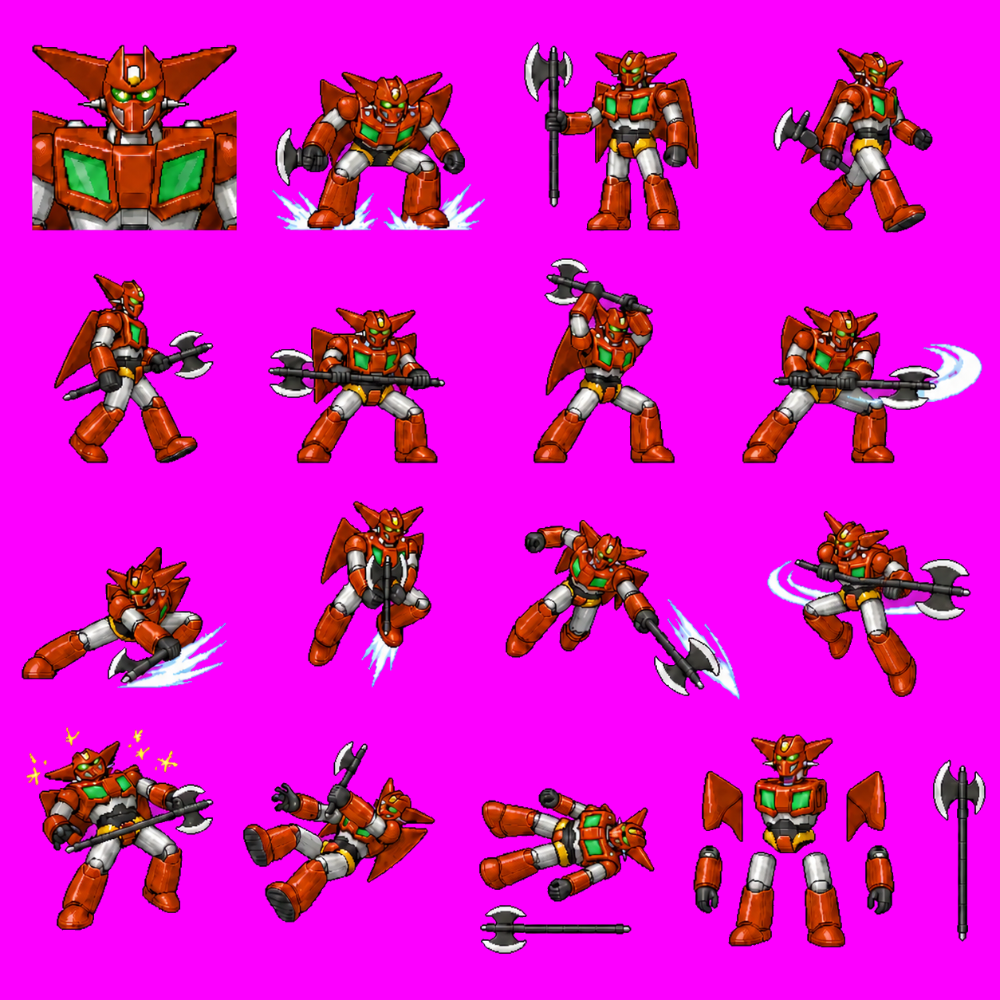
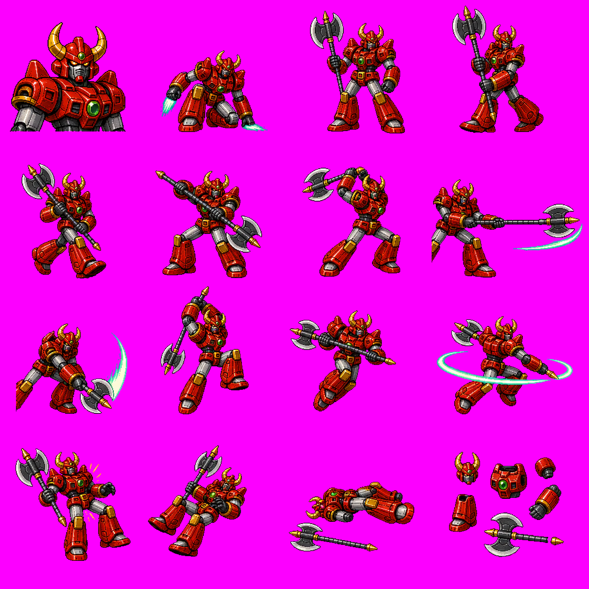
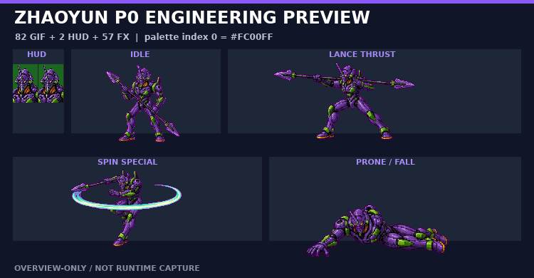
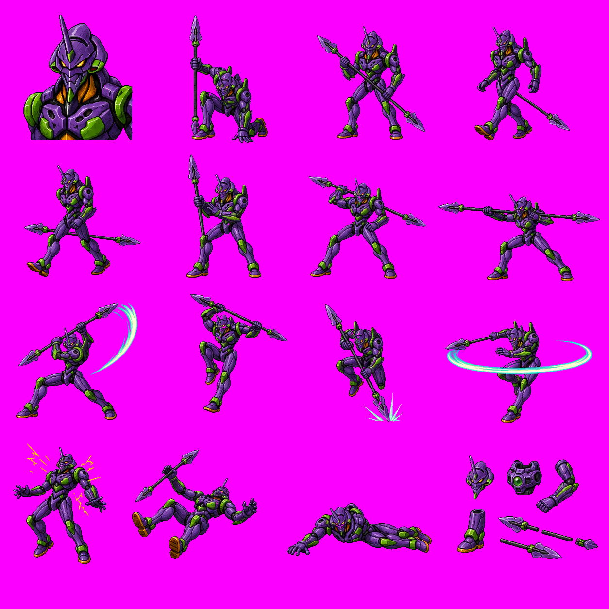
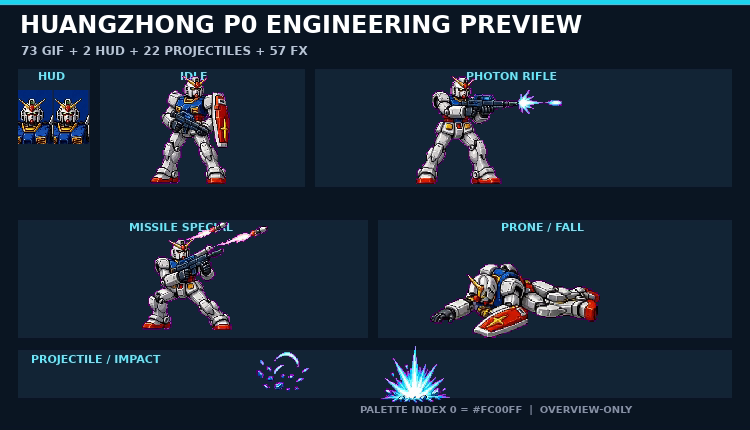
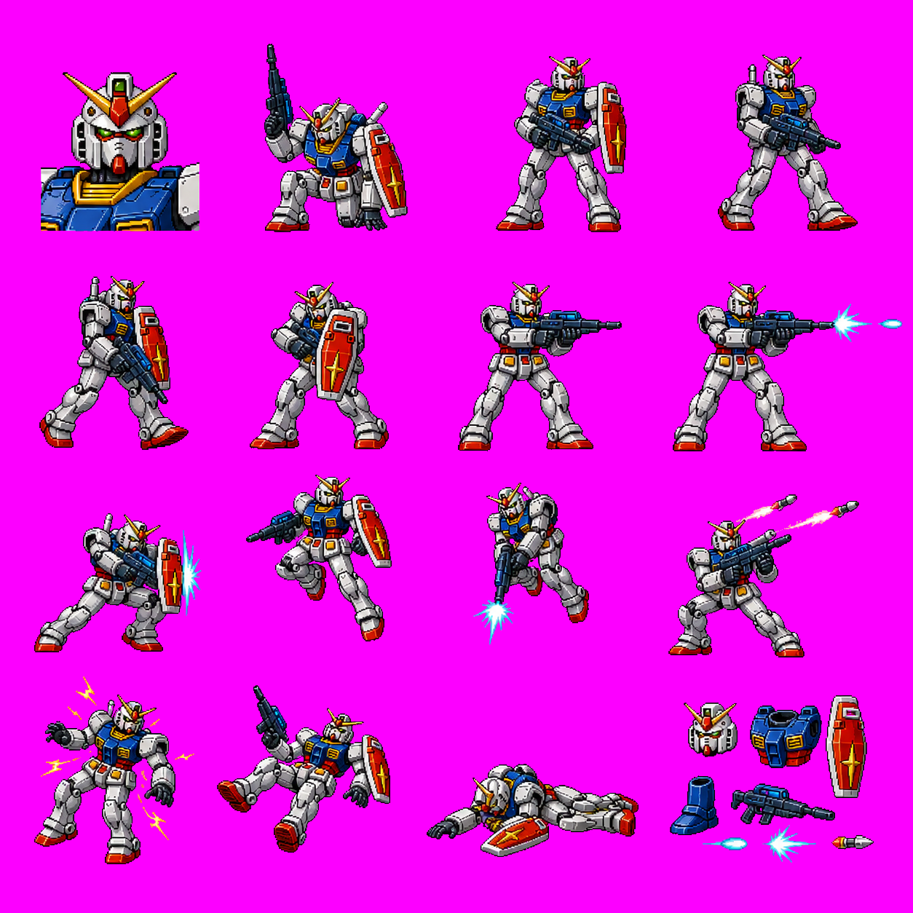
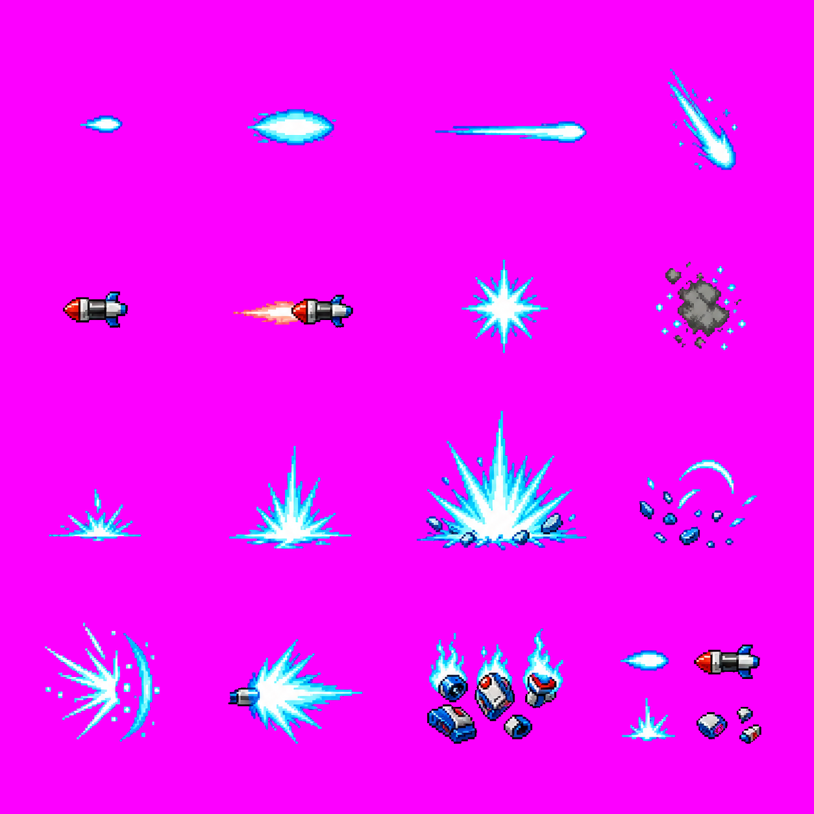
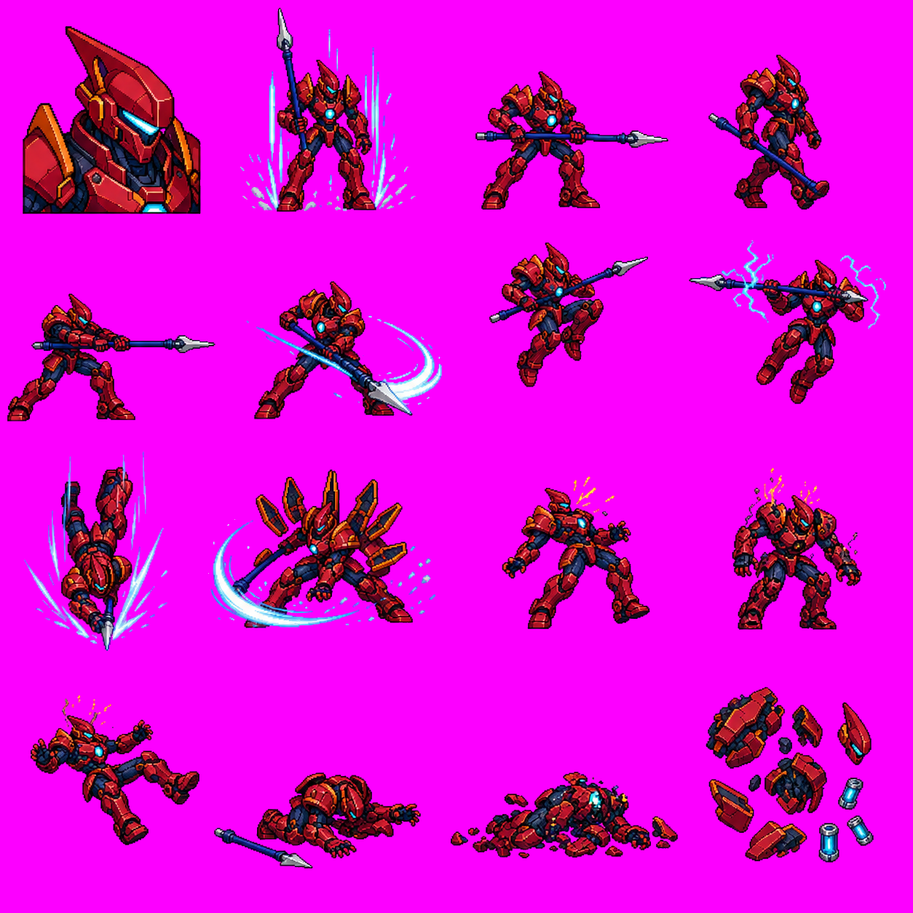
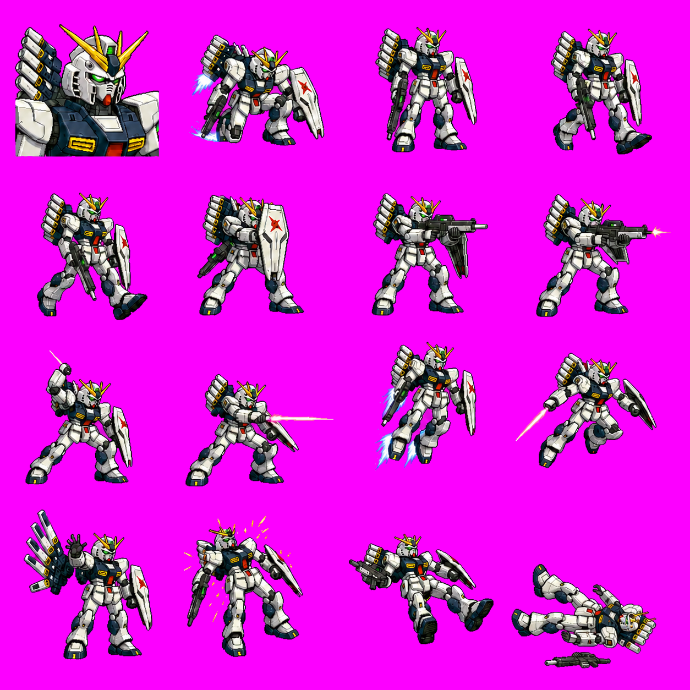

# Warriors of Fate → Super Robot Wars remake research

本 repository 記錄以 OpenBOR 版《吞食天地 II：赤壁之戰》為技術研究樣本，逐步整理可重製為機器人大戰風格橫向動作遊戲的方法。研究以不覆寫原始素材、可重現分析與跨平台發行為原則。

## 公開／本機素材邊界

公開 repo 可以保留「分鏡總覽 PNG／SVG」供工程溝通，但不收錄可直接重用的單張原作 GIF、頭像 GIF、PAK、音效、第三方 concept 原圖或逐幀 fan-project sprite。這些素材一律留在被 `.gitignore` 排除的 `private_assets/`、`robot_wof_concept/`、`robot_wof_enemy/`、`robot_boss/` 與 `workplace/`；GitHub 保存方法、尺寸與路徑 manifest、總覽圖、轉檔腳本與驗證器。

## 文件索引

| 文件 | 用途 |
| --- | --- |
| [Docker 隔離編譯與 smoke test](docs/DOCKER_LINUX_BUILD.md) | 不安裝 host 套件；在 Docker 內編譯 GIF-compatible OpenBOR v7533、建立 raw-data stage 並驗證模型載入。 |
| [美術協作與交付手冊](docs/ARTIST_HANDOFF.md) | 多藝術家分工、私有／公開素材界線、每張圖的交付欄位、review state 與第一批 Mazinger 工作包。 |
| [本機 raw-data smoke test](docs/LOCAL_SMOKE_TEST.md) | 建立不污染原始解包資料的 merged tree、修正 staging 大小寫並啟動 OpenBOR 驗證 overlay。 |
| [Mazinger 私有資產對位產線](docs/PRIVATE_ASSET_PIPELINE.md) | 從本機 key pose 建立 basic 或 41-file full-P0 engineering prototype，強制 canvas、Offset 與 palette index 0。 |
| [機器人大戰素材替換總計畫](docs/ROBOT_WOF_ASSET_REPLACEMENT_PLAN.md) | 五角色、場景、UI、里程碑、人力與驗收閘門；說明如何從 moodboard 走到可玩的視覺替換。 |
| [無敵鐵金剛 vertical slice](docs/MAZINGER_VERTICAL_SLICE.md) | 張飛 slot 的第一組實作入口：12 張 key pose、overlay 流程與透明色驗收。 |
| [關羽紅色月牙戰士 P0 vertical slice](docs/GUANYU_VERTICAL_SLICE.md) | 關羽 slot 的 65 主 GIF、2 profiles、33 shared FX、284-file overlay、strict／Docker 實測與 deferred closure。 |
| [趙雲紫色神經長槍機 P0 vertical slice](docs/ZHAOYUN_VERTICAL_SLICE.md) | 趙雲 slot 的 82 主 GIF、2 profiles、57 shared FX、398-file merged overlay、determinism／strict／Docker 與 deferred closure。 |
| [黃忠蒼藍光子射手機 P0 vertical slice](docs/HUANGZHONG_VERTICAL_SLICE.md) | 黃忠 active-player 73 GIF、2 profiles、8 個 projectile models／22 GIF、503-file merged overlay、19 TXT strict／determinism／Docker 與 `h1`–`h16` deferred closure。 |
| [無敵鐵金剛 P0 對照](research/MAZINGER_P0_FRAME_MAP.md) | 42 個 case-sensitive P0 引用、41 個實體 GIF、canvas／Offset、12 格映射與缺幀表。 |
| [Stage01 替換 manifest](research/STAGE01_REPLACEMENT_MANIFEST.md) | 第一關背景、前景、幾何、敵人、物件與 FX 的 P0／P1／P2 清單。 |
| [敵軍與 Boss 概念對位表](research/ENEMY_BOSS_CONCEPT_MAP.md) | 島田兵式一般巡邏兵頭像、量產敵軍 family、美女 Boss、巨大主角機 Boss 與四個主線 gate 的交付規格。 |
| [Boss 圖像製作與整合計畫](docs/BOSS_PRODUCTION_PLAN.md) | `robot_boss` 概念頁轉成美女三人組、Gunbuster 類巨型主角機、兩階段 Boss、必要分鏡、依賴閉包與 Docker 驗收 Gate。 |
| [李典紅槍指揮機 Stage01 vertical slice](docs/LIDIAN_BOSS_VERTICAL_SLICE.md) | 第一套 Boss 工程閉包：16 格安全 crop、69 GIF＋6 model TXT、Lidian-local 機械死亡 remap 與 Docker 驗證。 |
| [藍盔巡邏機 Stage01 vertical slice](docs/BLUE_HELMET_GRUNT_VERTICAL_SLICE.md) | 第一套原創機械雜兵：12 格安全切圖、42-file `bing`／`bingxs` engineering overlay、機械死亡與 Docker 驗證。 |
| [Stage01 場景與機械補給箱 vertical slice](docs/STAGE01_ENVIRONMENT_VERTICAL_SLICE.md) | 原創森林機械前哨長圖、透明遮罩／wall manifest、掃描光 FX、三格補給箱、exact-case 與 Docker 驗證。 |
| [五人選角與無敵鐵金剛 HUD vertical slice](docs/SELECTION_AND_HUD_VERTICAL_SLICE.md) | 480×276 五人選角合成圖、張飛 icon／profile、opaque index0 方法與 M1 89/89 驗證。 |
| [ν Gundam 第六可選角色工程計畫](docs/NU_GUNDAM_SIXTH_CHARACTER_PLAN.md) | 第六候選角色、六人 `allowselect`、480×276 roster、HUD、Fin Funnel 子模型與 2P／引擎上限。 |
| [夏亞／有腳吉翁克 Boss 工程計畫](docs/ZEON_BOSS_WITH_LEGS_PLAN.md) | 完成型有腳 Boss、夏亞 cut-in、67-GIF P0 閉包、遠距／抓投／HP 分支與人類素材清除。 |
| [角色替換分鏡總表](research/CHARACTER_SPRITE_INVENTORY.md) | 關羽、趙雲、張飛、魏延、黃忠的動作群組、GIF 分鏡、優先級與分離模型說明。美術替換工作從此開始。 |
| [跨平台建置與發行](docs/BUILD.md) | OpenBOR 引擎在 Linux、Windows、macOS 的原生編譯依賴、CMake 指令、產物位置與 PAK 放置位置。 |
| [OpenBOR 引擎編譯手冊](docs/OPENBOR_COMPILATION.md) | 從取得原始碼到 Linux、Windows、macOS 原生編譯、產物驗證與疑難排解的完整交接文件。 |
| [角色素材規格](docs/SPRITE_ART_SPEC.md) | GIF palette index 0 洋紅鍵色 `#FC00FF`、畫布／檔名／調色盤規則，以及美術交付驗收清單。 |
| [選角與頭像素材](docs/PORTRAIT_ASSETS.md) | 五名可選角色、Boss、軍隊與 HUD profile 的現有頭像清單；也說明新增劉備、曹操、呂布等角色時需要改哪些檔案。 |
| [機體、駕駛員與大頭照 roster](docs/PILOT_AND_PORTRAIT_ROSTER.md) | 流龍馬、兜甲兒、碇真嗣、阿姆羅、迷你哥吉拉、夏亞的 slot 對應，及 selection／HUD／cut-in 分層方式。 |
| [分鏡表產生器](scripts/generate-character-sprite-inventory.mjs) | 從解出的角色定義 `.txt` 重新統計分鏡表，避免人工維護 GIF 清單。 |
| [OpenBOR 資產驗證器](scripts/validate-openbor-assets.mjs) | 檢查 TXT 圖像引用、路徑大小寫、indexed GIF、canvas 與 palette index 0。 |
| [Vertical slice coverage](docs/VERTICAL_SLICE_COVERAGE.md) | 檢查 M1 預定替換是否真的齊全且不是 base copy；包含 `bingxs` 與機械死亡 model overlay。 |
| [Overlay parity validator](scripts/validate-overlay-parity.mjs) | 逐檔檢查 exact-case base counterpart、相同 canvas、indexed GIF 與 index 0 `#FC00FF`。 |
| [Docker Linux builder](scripts/build-openbor-linux-docker.sh) | 唯讀掛載 OpenBOR source，將相依套件與 Linux x86-64 編譯封裝在 Docker。 |
| [Docker headless smoke](scripts/run-openbor-smoke-docker.sh) | 以同一 image 載入私有 raw-data stage，並依 OpenBOR Log 判斷模型載入是否完成。 |
| [Stage01 成果展示圖產生器](scripts/build-stage01-engineering-preview.mjs) | 將目前工程輸出合成一張 480×276 overview-only review image；依 repo policy 保留，但不代表 legal／public-safe。 |
| [趙雲 P0 成果展示圖產生器](scripts/build-zhaoyun-engineering-preview.mjs) | 從 private overlay 的 HUD、idle、突刺、旋槍與倒地輸出建立 750×390 overview-only 成果圖。 |
| [黃忠 P0 builder](scripts/build-huangzhong-p0-prototype.mjs) | 從 16 個主姿勢與 16 格 projectile／FX inventory 建立 active-player、HUD、8 個 projectile model、case fixes 與 build manifest。 |
| [黃忠 P0 成果展示圖產生器](scripts/build-huangzhong-engineering-preview.mjs) | 從 private overlay 的 HUD、idle、光子步槍、飛彈、倒地與 impact GIF 建立 750×430 overview-only 成果圖。 |

## 專案範圍

- 研究 OpenBOR 模組的角色、關卡、腳本和資產結構。
- 目前 concept mapping：關羽→蓋特、張飛→無敵鐵金剛、趙雲→EVA 初號機、黃忠→RX-78-2、魏延→機械哥吉拉；量產前仍須完成 roster 與權利確認。
- 維持原動作定義的碰撞箱、攻擊時序與地面對齊，先完成視覺替換，再調整玩法。
- 發行時以一個共用遊戲 PAK 搭配各作業系統的原生 OpenBOR 引擎。

## 建議工作順序

1. 先依分鏡總表完成一名角色的 P0（基本可玩）GIF。
2. 在本機測試動畫、透明色、Offset、BBox 與 attack 時序。
3. 擴充 P1／P2 動作及騎乘、投射物等分離模型。
4. 先以 Docker 完成 Linux 載入閘門，再由 Windows／macOS runner 製作並測試各平台原生引擎。

## 目前完成成果展示

下圖直接使用目前 private engineering overlay 的實際輸出合成：Stage01 森林機械前哨、張飛 slot／無敵鐵金剛、兩名藍盔巡邏機、機械補給箱、李典紅槍指揮機與張飛 HUD。它是由 repository 腳本重建、依 repo policy 保留的 480×276 **overview-only review image／engineering composite**，用來檢查整體方向；不是 OpenBOR runtime capture，不代表逐格 production 美術已完成，也不得宣稱已通過法律或公開散布權利審核（`legal-safe`／`public-safe`）。


重建方式：

```bash
node scripts/build-stage01-engineering-preview.mjs \
  --workspace /path/to/private-project-workspace \
  --output research/previews/stage01-engineering-composite.png
```

真正 runtime 截圖要等可見畫面的 runner 自動完成選角、進關與截圖；目前 Docker smoke 使用 dummy video driver，只能證明引擎與 models 載入成功。

## 分鏡總覽

每張圖為該角色主定義直接引用的 GIF 第一幀；格子下方是原始檔名。完整動作對照請看[角色替換分鏡總表](research/CHARACTER_SPRITE_INVENTORY.md)。

### 關羽


### 趙雲


### 張飛


### 魏延


### 黃忠


## 無敵鐵金剛 vertical slice

這是張飛 slot 第一輪的 12 個概念 key pose。第 07／08、11／12 格已按角色實際跨格範圍重切，不再混入相鄰姿勢的腳；它們仍是重畫底稿，不是完成的 OpenBOR GIF。張飛 P0 共有 42 個 case-sensitive 引用，完整差距請看[無敵鐵金剛 P0 對照](research/MAZINGER_P0_FRAME_MAP.md)。

目前 private engineering overlay 已覆蓋 41/41 physical GIF、42/42 logical refs、34/34 P0 animations，並在 Docker OpenBOR v7533 載入到 `Loading models... Done!`。這批仍由 12 個姿勢重用而來，20 張有 canvas clamp，只能當可啟動的對位骨架，不能標為 production-ready。


## 關羽紅色月牙戰士 P0 vertical slice

> **注意：下方 v1 機器人造型已淘汰。** 它被確認更像牛角武者鋼彈，而不是蓋特系機器人。圖片與 65-GIF overlay 只保留為工程驗證紀錄；藝術家不可沿用其牛角、V-fin、武者兜或面罩。關羽 v2 正在以水平紅色側翼、雙綠胸窗、紅色翼肩、銀白四肢與雙刃戰斧重畫。

關羽蓋特系 v2 canonical storyboard 已更新到 v5：單端雙刃斧在全動作保持一致，缺腳／多手／拆件數量問題已逐格關閉；目前下一步是依原 65 張 canvas／Offset 重建 private GIF 與三張 UI 圖。



這張 16 格關羽 slot 總覽已重鍵為精確 `#FC00FF`。完整 overview 保留原構圖；private key-pose pipeline 另採 independent safe crops，避免 08、10、11、12、15 跨名義 4×4 格線時切到長柄武器或相鄰姿勢。依 repo policy，它只是一張 **overview-only review image**，不是可拆用的 production sprite sheet，也不能宣稱 `legal-safe`／`public-safe`。

private engineering overlay 實測為 65 張關羽主 GIF、2 張 HUD profiles、33 張 shared FX palette normalization，以及 `guanyu.txt`／`models.txt`，合併整包共 284 files；六份指定 TXT strict 全 PASS，Docker OpenBOR v7533 到 `Loading models... Done!`。bounded smoke 的 exit 124 是到達 gate 後 timeout 的預期結果；TERM 後 double-free 是既知 teardown。

這批仍把 16 個 key pose 重用到 65 張主模型 GIF；`g1`–`g16`、gore remap、`playerdie.wav` 與逐格補間都明確 deferred，所以不能稱為完整玩家角色。完整範圍與驗證方式見[關羽紅色月牙戰士 P0 vertical slice](docs/GUANYU_VERTICAL_SLICE.md)。



## 趙雲紫色神經長槍機 P0 vertical slice

這張 16 格趙雲 slot 總覽已重鍵為精確 `#FC00FF`。完整 overview 保留構圖；private key-pose pipeline 另用 independent safe crops，避免 08–16 的長槍、額角、雙腳或特效被名義 4×4 格線切斷。依 repo policy，它只是 **overview-only review image**，不是可拆用的 production sprite sheet，也不能宣稱 `legal-safe`／`public-safe`。

趙雲 batch 實測 147 files：82 主 GIF、2 profiles、57 shared FX 與 6 份 TXT／scripts；合併 overlay `data/` 為 398 files（372 GIF＋26 other）。`zhaoyun.txt` 464 occurrences／82 paths strict PASS，主檔加 7 份輔助 TXT、共 8 份 strict 全 PASS，fresh rebuild 147／147 byte-identical；Docker v7533 到 `Loading models... Done!`。exit 124 是 timeout 預期值，TERM 後 double-free 是既知 teardown。

本輪只把5個 `blood1` hitflash 局部 remap 到 `flashb`、把1個魏延 fall 誤引用改回趙雲 `fall2`，並修正5個 script include case。16 poses 仍大量重用；`y1`–`y16`、cross-character audio QA、逐格補間、實戰 BBox／attack box 與2P都 deferred，所以不能稱為完整玩家角色。完整範圍見[趙雲紫色神經長槍機 P0 vertical slice](docs/ZHAOYUN_VERTICAL_SLICE.md)。

下圖直接由 private overlay 已建立的 HUD、idle、長槍突刺、旋槍 special 與 prone/fall GIF 合成；它是工程成果截圖，不是 runtime capture。





## 黃忠蒼藍光子射手機 P0 vertical slice

黃忠 slot 已建立一套遠距工程閉包：73 張 active-player GIF、2 張 HUD profiles、8 個 projectile models 的 22 張有效投射物／命中 GIF、57 張 shared FX 正規化與 11 份 TXT／scripts。與既有成果合併後，private overlay `data/` 共 503 files（470 GIF＋33 other）；主模型 438 occurrences／73 paths，加上投射物與 runtime closure 共 19 份 TXT strict 全 PASS，fresh rebuild 165／165 non-manifest files byte-identical。

Docker 使用 GIF-compatible OpenBOR v7533／commit `5c82614` 到 `Loading models... Done!`；bounded smoke exit 124 是 timeout 預期值。另一份較新的 CMake binary 會拒絕這個舊模組的 GIF background，不能拿它誤判素材失敗。

本輪把 5 個 `blood2` hitflash 局部改為 `flashb`，並修正主模型、projectile、Jflash、fire、models 與 scripts 共 187 次 Linux/macOS exact-case reference。16 個主姿勢與 16 格 projectile／FX inventory 仍有大量 pose reuse；`h1`–`h16`、逐格補間、BBox／attack box、獨立 projectile pivot、音效與 2P 都 deferred，不能稱為 production-ready。完整工程範圍見[黃忠蒼藍光子射手機 P0 vertical slice](docs/HUANGZHONG_VERTICAL_SLICE.md)。

下圖直接由 private overlay 已建立的 HUD、idle、光子步槍、飛彈 special、倒地與 impact GIF 合成，是目前完成成果的工程展示圖，不是 runtime capture。



下列兩張圖是每類動作／FX 都放在同一張圖片上的 overview-only 總覽；private pipeline 依 manifest 逐格安全裁切。角色表的第 08 格 beam、第 12 格雙飛彈與第 15 格兩腿兩腳已確認完整；projectile 表第 15／16 格是多物件 inventory，production 必須逐件另裁與定 pivot。





## 選角與 UI 頭像總覽

現有的可選角色、Boss、軍隊與 HUD profile 頭像；路徑與新增劉備、曹操、呂布等人物的方式請見[選角與頭像素材文件](docs/PORTRAIT_ASSETS.md)。


## 敵軍與 Boss 美術方向

- `robot_wof_enemy/` 現有的是一張含第三方海報、遊戲截圖與 UI 的「島田兵」概念拼貼，不是 clean sprite sheet；整張與任何裁圖都維持 private。可抽象採用「藍色圓盔、深色面罩、量產通信兵」語彙，正式 sprite、24×36 model icon 與 optional 64×94 對話頭像都從原創藍盔量產兵重畫。
- Stage01 前兩段 `bing` 共出現 57 次，是第一個一般敵人 P0 的正確 slot；最小不漏舊人物幀的閉包是 31 主 GIF＋1 icon＋6 palette maps＋4 `bingxs` debris＝42 張，以及 `bing.txt`／`bingxs.txt` 的 exact-case 與機械死亡 rewrite。
- 一般巡邏兵以「藍色頭盔、遮面面罩、冷色鏡片」為原創通訊頭像語彙；參考 JPEG 不直接裁切使用。
- 第一關 `lidian` 已做成原創紅槍指揮機 engineering closure；第二關 `xiahorse` 必須連同四足載具解體與駕駛員一起替換。
- `robot_boss/` 三張 private concept 分別只提供「黑甲翼肩守門者／晶核腦形暗黑巨像」、「約 200m 級輪廓比例」與「成年女性指揮官／祭司／軍官」等抽象 brief；沒有標籤的機體與人物不猜名稱，不上傳原圖、裁圖或縮圖。
- `lidian` 原 runtime semantic closure 是 175 張 unique GIF；透過 Lidian-local 機械爆炸／碎片 remap，第一個 Boss 的實際 boss-specific 美術工作包可收斂為 52 body＋9 fragments＋8 capsule／drone＝69 張。這個數字是 engineering art closure，不等於 175 張 runtime 驗證閉包消失。
- Stage03A `xuchu` 是大型主角機鏡像 Boss 的首選槽位。Gunbuster 是使用者提出的 private 尺度例子；公開成品改為輪廓、頭冠、胸徽、配色與武器都不同的原創巨機。
- Stage03B `meimei`／`meiya`／`meiling` 規劃為三位明確成年的女性王牌／指揮官；可共用 technical rig，輪廓、臉型、髮型、服裝、配色、武器與頭像不可共用。
- 女性概念頁是私人構圖與氣質參考，不是原作 Boss roster；圖中人物姓名與年齡無法由未標註 collage 安全確認，因此公開 production brief 不猜測個別角色身分。

完整槽位、私有 concept 使用邊界、巨大 Boss 的純換圖／玩法改造兩條路，以及每包必交檔案，見[敵軍與 Boss 概念對位表](research/ENEMY_BOSS_CONCEPT_MAP.md)。

藝術家與 OpenBOR 整合者應再依[Boss 圖像製作與整合計畫](docs/BOSS_PRODUCTION_PLAN.md)交付每個 Boss 的主模型、投射物、分離模型、肖像、geometry migration 與可玩驗收證據。私有筆記中的第三方名稱只用來討論尺度、節奏或氣氛，不是 production roster；三張私有概念頁不進 repo，README 只顯示原創總覽與可公開的工程資訊。


### 第一套 Boss：李典紅槍指揮機

這張原創 16 格總覽涵蓋 Boss show、spawn、idle、walk、刺擊、橫掃、空中攻擊、special、兩種受擊、擊退、倒地、死亡與機械碎片。private engineering overlay 已完成 Stage01 active closure 的 69/69 GIF＋6/6 model TXT；人體 blood／organ 召喚只在 Lidian overlay 內改成 `Flashb`、`Dust` 與私有機械碎片，並通過 182-file parity、六份 model strict 與 Docker v7533 model-load。它仍由 16 個 pose 重用，不是 production-ready，完整交接請看[李典紅槍指揮機 Stage01 vertical slice](docs/LIDIAN_BOSS_VERTICAL_SLICE.md)。



### 第一套一般敵人：藍盔巡邏機

這張是原創的 12 格美術審稿總覽，已把生成背景正規化為精確 `#FC00FF` 並移除白色格線。對應的 private engineering overlay 已完成 `bing`／`bingxs` 42 張實體圖、移除人類 gore、通過 exact-case／canvas／index0 與 Docker v7533 model-load gate；但 12 姿勢仍大量重用，詳見[藍盔巡邏機 Stage01 vertical slice](docs/BLUE_HELMET_GRUNT_VERTICAL_SLICE.md)。


### Stage01 森林機械前哨與補給箱

三張背景長圖沿用原 palette-index-0 遮罩 footprint，不複製原背景顏色；保留 2600×276／2429×276／2429×272 畫布、橋洞、前景遮擋與 wall 對位。另加入原創青色掃描光及三格機械補給箱。加入李典後，private overlay 整包 182 files 仍通過 parity，Stage01 level／box strict 與 Docker v7533 model-load 也通過；完整限制見[Stage01 場景與機械補給箱 vertical slice](docs/STAGE01_ENVIRONMENT_VERTICAL_SLICE.md)。


### 五人機器人選角與 HUD

五欄依序對應關羽、張飛、趙雲、黃忠、魏延，合成圖保留頭肩肖像與全身站姿；張飛 slot 另產出 35×54 icon／profile／mirror profile。M1 coverage 已達 89/89，詳見[五人選角與無敵鐵金剛 HUD vertical slice](docs/SELECTION_AND_HUD_VERTICAL_SLICE.md)。

這張 v1 五人圖的第一欄關羽已標記 `design-deprecated-v1`，後續必須連同 35×54 icon／profiles 換成蓋特系 v2。新增第六角 ν Gundam 則需要新的六人 roster／選角流程驗證，不視為本張五欄圖的既有成果。


### 夏亞／有腳吉翁克 Boss 候選分鏡

這是夏亞駕駛的完成型有腳 Boss 16 格 `art-candidate`。全身格以兩腿兩腳為硬性契約；有線手臂、回收、充能、發射、跳攻、受傷、擊飛與倒地均已分開。部分姿勢仍須 custom crop，完整 67-GIF 閉包與 stage 整合方式見[夏亞／有腳吉翁克 Boss 工程計畫](docs/ZEON_BOSS_WITH_LEGS_PLAN.md)。


### ν Gundam 第六可選角色分鏡

ν Gundam v5 已通過 16 格 anatomy 縮圖 gate；步槍、盾、光束劍與六枚 Fin Funnel 背架維持一致，Funnel 飛行與長光束會另做 projectile／FX。它是第六個**候選角色**，不是 `maxplayers 6`；同時遊玩仍維持 2P，完整 roster 與引擎限制見[ν Gundam 第六可選角色工程計畫](docs/NU_GUNDAM_SIXTH_CHARACTER_PLAN.md)。



## 注意事項

本模組現有角色 GIF 以 palette index 0 作透明鍵色，該色實值是 `#FC00FF`（RGB 252, 0, 255），不是常見的 `#FF00FF`。不要依賴 GIF transparency flag；驗收時要同時確認 indexed GIF 與 index 0。

原始 `wof.pak` 是研究輸入，不要覆寫。它含有舊版封包細節；正式發行前應另行建立並驗證與目前 OpenBOR 引擎相容的模組封包。
