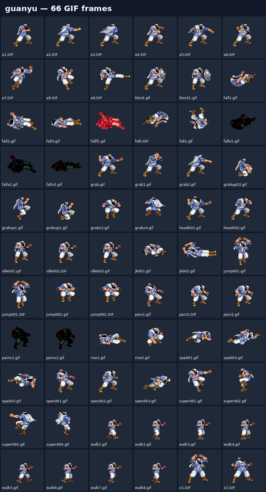
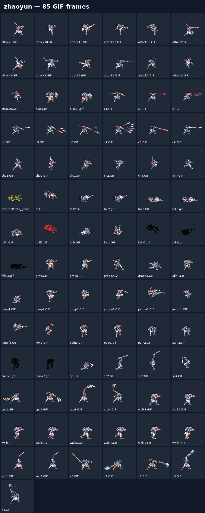
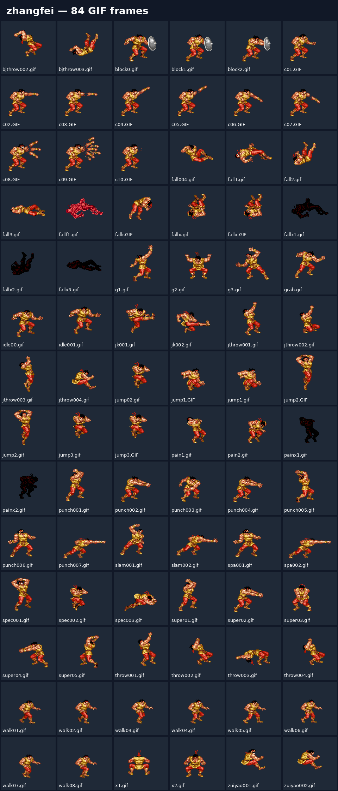
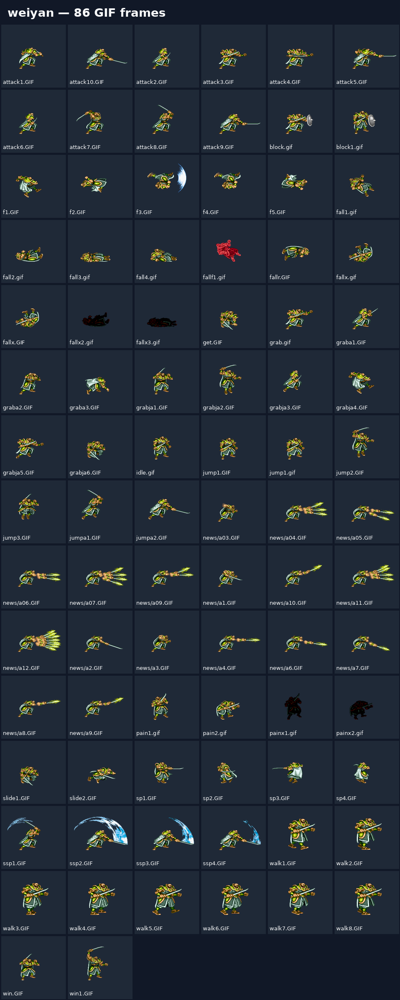
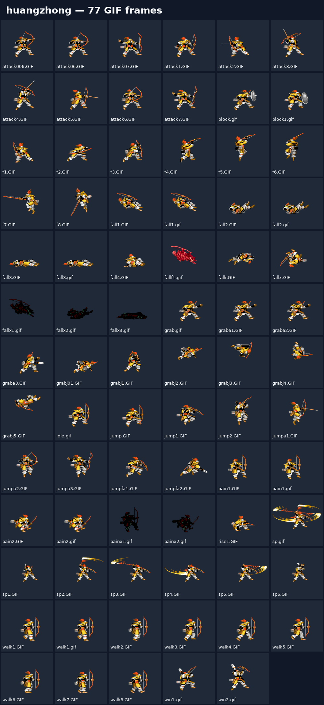
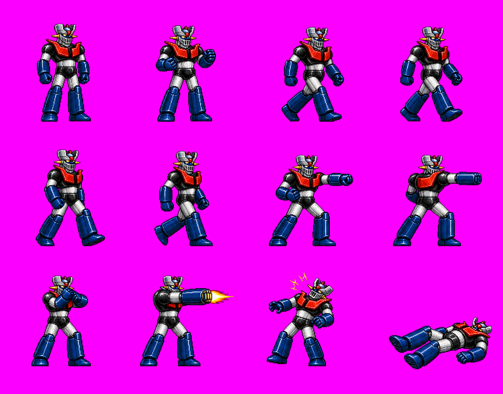
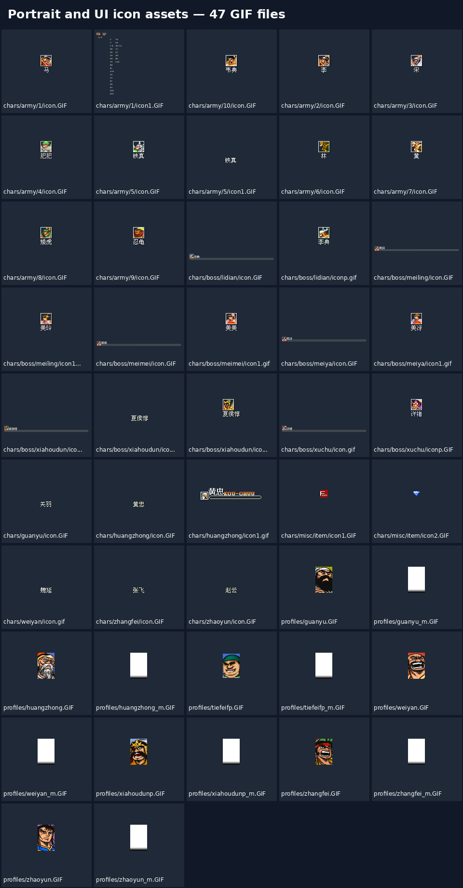
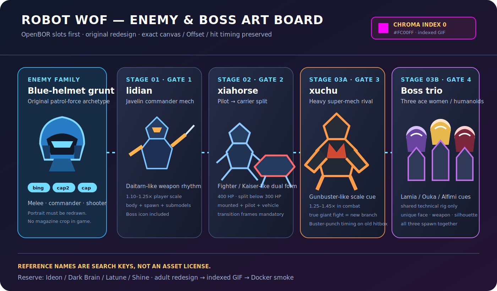
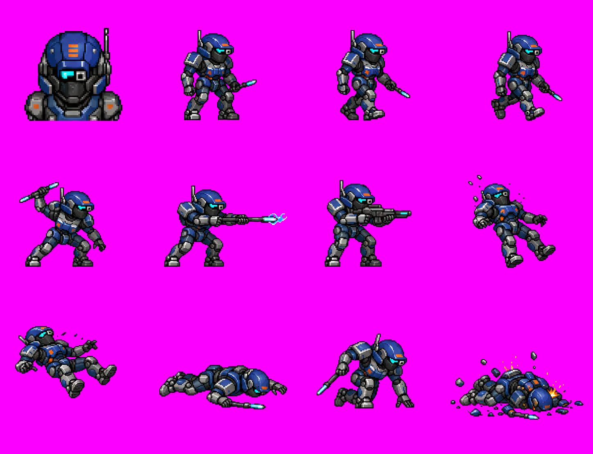

# Warriors of Fate → Super Robot Wars remake research

本 repository 記錄以 OpenBOR 版《吞食天地 II：赤壁之戰》為技術研究樣本，逐步整理可重製為機器人大戰風格橫向動作遊戲的方法。研究以不覆寫原始素材、可重現分析與跨平台發行為原則。

## 公開／本機素材邊界

公開 repo 可以保留「分鏡總覽 PNG／SVG」供工程溝通，但不收錄可直接重用的單張原作 GIF、頭像 GIF、PAK、音效、第三方 concept 原圖或逐幀 fan-project sprite。這些素材一律留在被 `.gitignore` 排除的 `private_assets/`、`robot_wof_concept/`、`robot_wof_enemy/`、`robot_boss/` 與 `workplace/`；GitHub 保存方法、尺寸與路徑 manifest、總覽圖、轉檔腳本與驗證器。

## 文件索引

| 文件 | 用途 |
| --- | --- |
| [Docker 隔離編譯與 smoke test](docs/DOCKER_LINUX_BUILD.md) | 不安裝 host 套件；在 Docker 內編譯 GIF-compatible OpenBOR v7533、建立 raw-data stage 並驗證模型載入。 |
| [美術協作與交付手冊](docs/ARTIST_HANDOFF.md) | 多藝術家分工、私有／公開素材界線、每張圖的交付欄位、review state 與第一批 Mazinger 工作包。 |
| [本機 raw-data smoke test](docs/LOCAL_SMOKE_TEST.md) | 建立不污染原始解包資料的 merged tree、修正 staging 大小寫並啟動 OpenBOR 驗證 overlay。 |
| [Mazinger 私有資產對位產線](docs/PRIVATE_ASSET_PIPELINE.md) | 從本機 key pose 建立 basic 或 41-file full-P0 engineering prototype，強制 canvas、Offset 與 palette index 0。 |
| [機器人大戰素材替換總計畫](docs/ROBOT_WOF_ASSET_REPLACEMENT_PLAN.md) | 五角色、場景、UI、里程碑、人力與驗收閘門；說明如何從 moodboard 走到可玩的視覺替換。 |
| [無敵鐵金剛 vertical slice](docs/MAZINGER_VERTICAL_SLICE.md) | 張飛 slot 的第一組實作入口：12 張 key pose、overlay 流程與透明色驗收。 |
| [無敵鐵金剛 P0 對照](research/MAZINGER_P0_FRAME_MAP.md) | 42 個 case-sensitive P0 引用、41 個實體 GIF、canvas／Offset、12 格映射與缺幀表。 |
| [Stage01 替換 manifest](research/STAGE01_REPLACEMENT_MANIFEST.md) | 第一關背景、前景、幾何、敵人、物件與 FX 的 P0／P1／P2 清單。 |
| [敵軍與 Boss 概念對位表](research/ENEMY_BOSS_CONCEPT_MAP.md) | 島田兵式一般巡邏兵頭像、量產敵軍 family、美女 Boss、巨大主角機 Boss 與四個主線 gate 的交付規格。 |
| [藍盔巡邏機 Stage01 vertical slice](docs/BLUE_HELMET_GRUNT_VERTICAL_SLICE.md) | 第一套原創機械雜兵：12 格安全切圖、42-file `bing`／`bingxs` engineering overlay、機械死亡與 Docker 驗證。 |
| [角色替換分鏡總表](research/CHARACTER_SPRITE_INVENTORY.md) | 關羽、趙雲、張飛、魏延、黃忠的動作群組、GIF 分鏡、優先級與分離模型說明。美術替換工作從此開始。 |
| [跨平台建置與發行](docs/BUILD.md) | OpenBOR 引擎在 Linux、Windows、macOS 的原生編譯依賴、CMake 指令、產物位置與 PAK 放置位置。 |
| [OpenBOR 引擎編譯手冊](docs/OPENBOR_COMPILATION.md) | 從取得原始碼到 Linux、Windows、macOS 原生編譯、產物驗證與疑難排解的完整交接文件。 |
| [角色素材規格](docs/SPRITE_ART_SPEC.md) | GIF palette index 0 洋紅鍵色 `#FC00FF`、畫布／檔名／調色盤規則，以及美術交付驗收清單。 |
| [選角與頭像素材](docs/PORTRAIT_ASSETS.md) | 五名可選角色、Boss、軍隊與 HUD profile 的現有頭像清單；也說明新增劉備、曹操、呂布等角色時需要改哪些檔案。 |
| [分鏡表產生器](scripts/generate-character-sprite-inventory.mjs) | 從解出的角色定義 `.txt` 重新統計分鏡表，避免人工維護 GIF 清單。 |
| [OpenBOR 資產驗證器](scripts/validate-openbor-assets.mjs) | 檢查 TXT 圖像引用、路徑大小寫、indexed GIF、canvas 與 palette index 0。 |
| [Vertical slice coverage](docs/VERTICAL_SLICE_COVERAGE.md) | 檢查 M1 預定替換是否真的齊全且不是 base copy；包含 `bingxs` 與機械死亡 model overlay。 |
| [Overlay parity validator](scripts/validate-overlay-parity.mjs) | 逐檔檢查 exact-case base counterpart、相同 canvas、indexed GIF 與 index 0 `#FC00FF`。 |
| [Docker Linux builder](scripts/build-openbor-linux-docker.sh) | 唯讀掛載 OpenBOR source，將相依套件與 Linux x86-64 編譯封裝在 Docker。 |
| [Docker headless smoke](scripts/run-openbor-smoke-docker.sh) | 以同一 image 載入私有 raw-data stage，並依 OpenBOR Log 判斷模型載入是否完成。 |

## 專案範圍

- 研究 OpenBOR 模組的角色、關卡、腳本和資產結構。
- 目前 concept mapping：關羽→蓋特、張飛→無敵鐵金剛、趙雲→EVA 初號機、黃忠→RX-78-2、魏延→機械哥吉拉；量產前仍須完成 roster 與權利確認。
- 維持原動作定義的碰撞箱、攻擊時序與地面對齊，先完成視覺替換，再調整玩法。
- 發行時以一個共用遊戲 PAK 搭配各作業系統的原生 OpenBOR 引擎。

## 建議工作順序

1. 先依分鏡總表完成一名角色的 P0（基本可玩）GIF。
2. 在本機測試動畫、透明色、Offset、BBox 與 attack 時序。
3. 擴充 P1／P2 動作及騎乘、投射物等分離模型。
4. 先以 Docker 完成 Linux 載入閘門，再由 Windows／macOS runner 製作並測試各平台原生引擎。

## 分鏡總覽

每張圖為該角色主定義直接引用的 GIF 第一幀；格子下方是原始檔名。完整動作對照請看[角色替換分鏡總表](research/CHARACTER_SPRITE_INVENTORY.md)。

### 關羽

### 趙雲

### 張飛

### 魏延

### 黃忠

## 無敵鐵金剛 vertical slice

這是張飛 slot 第一輪的 12 個概念 key pose。第 07／08、11／12 格已按角色實際跨格範圍重切，不再混入相鄰姿勢的腳；它們仍是重畫底稿，不是完成的 OpenBOR GIF。張飛 P0 共有 42 個 case-sensitive 引用，完整差距請看[無敵鐵金剛 P0 對照](research/MAZINGER_P0_FRAME_MAP.md)。

目前 private engineering overlay 已覆蓋 41/41 physical GIF、42/42 logical refs、34/34 P0 animations，並在 Docker OpenBOR v7533 載入到 `Loading models... Done!`。這批仍由 12 個姿勢重用而來，20 張有 canvas clamp，只能當可啟動的對位骨架，不能標為 production-ready。

## 選角與 UI 頭像總覽

現有的可選角色、Boss、軍隊與 HUD profile 頭像；路徑與新增劉備、曹操、呂布等人物的方式請見[選角與頭像素材文件](docs/PORTRAIT_ASSETS.md)。

## 敵軍與 Boss 美術方向

- 一般巡邏兵以「藍色頭盔、遮面面罩、冷色鏡片」為原創通訊頭像語彙；參考 JPEG 不直接裁切使用。
- 第一關 `lidian` 先做中型指揮官機，第二關 `xiahorse` 必須連同載具解體與駕駛員一起替換。
- Stage03A `xuchu` 是大型主角機鏡像 Boss 的首選槽位，可參考 Gunbuster 類巨大感，但公開美術採原創再設計。
- Stage03B `meimei`／`meiya`／`meiling` 規劃為三位美女型王牌；可共用 technical rig，輪廓、配色、武器與頭像不可共用。

完整槽位、私有 concept 使用邊界、巨大 Boss 的純換圖／玩法改造兩條路，以及每包必交檔案，見[敵軍與 Boss 概念對位表](research/ENEMY_BOSS_CONCEPT_MAP.md)。

### 第一套一般敵人：藍盔巡邏機

這張是原創的 12 格美術審稿總覽，已把生成背景正規化為精確 `#FC00FF` 並移除白色格線。對應的 private engineering overlay 已完成 `bing`／`bingxs` 42 張實體圖、移除人類 gore、通過 exact-case／canvas／index0 與 Docker v7533 model-load gate；但 12 姿勢仍大量重用，詳見[藍盔巡邏機 Stage01 vertical slice](docs/BLUE_HELMET_GRUNT_VERTICAL_SLICE.md)。

## 注意事項

本模組現有角色 GIF 以 palette index 0 作透明鍵色，該色實值是 `#FC00FF`（RGB 252, 0, 255），不是常見的 `#FF00FF`。不要依賴 GIF transparency flag；驗收時要同時確認 indexed GIF 與 index 0。

原始 `wof.pak` 是研究輸入，不要覆寫。它含有舊版封包細節；正式發行前應另行建立並驗證與目前 OpenBOR 引擎相容的模組封包。
