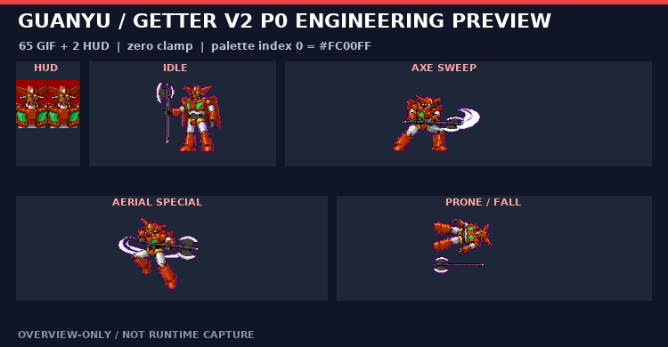
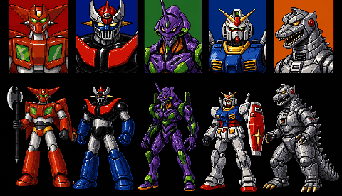

# 關羽 Getter v2 P0 vertical slice

> **美術方向淘汰警示（2026-07-15）：** v1 紅／黑／金牛角武者版本只保留作工程歷史，不得再交付藝術家描圖。現行 canonical 與 private runtime 均為 Getter v2：水平紅色頭部側翼、雙綠胸窗、紅色翼肩、銀白四肢與單端雙刃戰斧，沒有金色牛角、V-fin、武者兜或鋼彈式面罩。


新 v2 canonical storyboard 以 v5 為準：單端雙刃戰斧在 idle、walk、guard、attack、pain 與 special 維持一致；frame 12 有兩腿兩腳與完整斧頭，frame 15 是可數出一頭、兩手、兩腿、兩腳的側躺姿勢，frame 16 是 exact parts inventory。公開總覽已用 edge-connected matte 正規化為 `#FC00FF`。v5 已完成 16 格 independent safe crops、65 張主 GIF、2 profiles、角色 icon 與選角第一欄的 private engineering rebuild。

本批次把關羽 `guanyu` slot 的 Getter v2 與雙刃戰斧做成可載入 OpenBOR v7533 的 **private engineering prototype**。它驗證原畫布、前景中心／腳底、大小寫、indexed GIF、選角 palette 保護區與模型載入閉包；不是完整玩家角色，也不是逐格 production 動畫。




這張 16 格圖依公開 repo policy 保留為 **overview-only review image**，供藝術家討論輪廓、姿勢與缺格。它不是可直接拆用的 production sprite sheet，也不能據此宣稱素材已完成權利清查、`legal-safe` 或 `public-safe`。

## 實測範圍

| Overlay 類別 | Files | 說明 |
| --- | ---: | --- |
| 關羽主模型 GIF | 65 | 62 張由 key pose 對位的主動畫 GIF，加上 `icon.GIF`、`map1.GIF`、`red.gif` |
| HUD profiles | 2 | `data/profiles/guanyu.GIF`、`guanyu_m.GIF` |
| Shared FX palette normalization | 33 | `blackg`、`dust`、`dust2`、flash 系列；只正規化 palette index 0 |
| Model TXT | 2 | `data/chars/guanyu/guanyu.txt` 大小寫正規化、`data/models.txt` 的 `Bflash` 路徑修正 |
| 本批次新增 | **102** | 65＋2＋33＋2 |
| Getter v2 受控覆寫 | **68** | 65 main GIF＋2 profiles＋`data/bgs/select.gif`；不覆寫 `models.txt`、`guanyu.txt` 或已相同的 shared FX |
| 合併後 private overlay | **503** | 470 GIF＋33 other；替換既有 Guanyu/UI 路徑，總檔數不增加 |

65 張關羽主模型 GIF 仍由 16 個 key pose 大量重用。相同姿勢被配置到多張原畫布，只代表 engineering coverage，不代表動畫 timing、anticipation、follow-through 或逐格輪廓已完成。

## 16 格語意

| Frame | Key pose | 工程用途 |
| ---: | --- | --- |
| 01 | portrait | icon／profile 的造型參考 |
| 02 | spawn landing | `x1`／`x2` 登場骨架 |
| 03 | idle ready | idle 主姿勢 |
| 04–05 | walk contact／passing | 八格 walk 的兩姿勢交替骨架 |
| 06 | guard／block | block、grab 類對位 |
| 07–09 | wind-up／sweep／finisher | `a1`–`a9` 與長柄武器攻擊骨架 |
| 10–11 | jump takeoff／aerial attack | jump、rise、jumpattack 與空中 special 骨架 |
| 12 | spin special | `spec`／`super` 骨架 |
| 13 | pain recoil | pain 類受擊骨架 |
| 14–15 | fall／death | 擊退、倒地、死亡骨架 |
| 16 | debris inventory | 未進入本批次；只作機械碎片設計參考 |

原始 1254×1254 草圖不是可直接四等分的 sprite sheet：08、10、11、12、15 會跨名義格線。公開 overview 保留完整構圖，只把生成圖的漸層洋紅正規化為精確 `#FC00FF`；private key-pose 輸出才使用 manifest 記錄的 independent safe crops。工程輸出仍需逐檔套回原 canvas 與 Offset。

## 透明色與 UI 契約



- 所有透明角色／FX GIF 必須是 indexed GIF。
- palette **index 0** 必須精確為 `#FC00FF`，即 RGB `(252, 0, 255)`。
- 不可用近似洋紅、`#FF00FF`、alpha 或 GIF transparency flag 代替。
- `guanyu.GIF`／`guanyu_m.GIF` 是 opaque 35×54 HUD 圖；它們仍保留 index 0 `#FC00FF`，但 pixel data 不使用 index 0，避免 UI 出現洋紅洞。

## 建立 private overlay

先建立隔離素材工具 image；不在 host 安裝 Node package 或 FFmpeg：

```bash
docker build -f docker/asset-tools.Dockerfile \
  -t openbor-asset-tools:local .
```

以下假設公開 repo 掛在 `/repo`、private workspace 掛在 `/workspace`，輸出掛在 `/out`：

```bash
docker run --rm --user "$(id -u):$(id -g)" \
  -v "$PUBLIC_REPO:/repo" \
  -v "$PRIVATE_WORKSPACE:/workspace" \
  -v "$OUT:/out" \
  openbor-asset-tools:local \
  /repo/scripts/slice-guanyu-getter-v2-storyboard.mjs \
  --source /workspace/private_assets/robot_wof/guanyu/guanyu-getter-v2-storyboard-v5.png \
  --output-dir /out/keyposes \
  --contact-sheet /out/guanyu-getter-v2-overview.png \
  --manifest /out/guanyu-getter-v2-keyposes.json

docker run --rm --user "$(id -u):$(id -g)" \
  -v "$PUBLIC_REPO:/repo:ro" \
  -v "$PRIVATE_WORKSPACE:/workspace:ro" \
  -v "$OUT:/out" \
  openbor-asset-tools:local \
  /repo/scripts/build-guanyu-p0-prototype.mjs \
  --source-dir /out/keyposes \
  --keypose-manifest /out/guanyu-getter-v2-keyposes.json \
  --selection-source /workspace/private_assets/robot_wof/ui/five-robot-selection-screen-v2.png \
  --data-dir /workspace/workplace/extracted/data \
  --output-dir /out/runtime \
  --art-version getter-v2-storyboard-v5 \
  --placement-mode legacy-foreground-bounds
```

`five-robot-selection-screen-v2.png` 先由 [`compose-guanyu-selection-v2.mjs`](../scripts/compose-guanyu-selection-v2.mjs) 只合成第一欄；runtime `select.gif` 再由 [`build-guanyu-selection-runtime-v2.mjs`](../scripts/build-guanyu-selection-runtime-v2.mjs) 沿用原 palette，保護 `x>=103` 的其他四欄 indices。不要把輸出寫回 `workplace/extracted/`。

## 實測驗證結果

| Gate | Result |
| --- | --- |
| Merged overlay | 503 files；470 GIF＋33 other |
| Guanyu batch | 65 main GIF＋2 profiles＋33 shared FX＋`guanyu.txt`／`models.txt` |
| Fresh rebuild | 兩次 non-manifest output byte-identical；manifest 只差 `generatedAt` |
| Physical placement | 62/62；`clamp=0`、新增 canvas edge=0、最大 center/bottom drift=1px |
| Selection protection | `x>=103` 的 104,052 indices mismatch=0；palette byte mismatch=0 |
| Static contract | 503-file parity PASS；exact canvas、indexed GIF、palette index 0 `#FC00FF` 通過 |
| TXT strict | `guanyu.txt` 65 個 resolved paths 全部 PASS |
| Docker OpenBOR v7533 | cache `guanyu`，到 `Loading models... Done!` |
| Bounded smoke exit | `124`；到達載入閘門後由 timeout 結束，屬此 smoke 流程的預期結果 |

更細的 headless 證據獨立記錄於 [`../research/GUANYU_LINUX_SMOKE.md`](../research/GUANYU_LINUX_SMOKE.md)；它只證明 Linux 模型載入閘門，不代表可見 runner 已完成。

timeout 送出 TERM 後，舊版引擎可能在 teardown 印出 double-free。判讀順序必須是：先確認 TERM 前已有 `Loading models... Done!`，再把 TERM 後的 double-free 記為既知 teardown；不能把它說成正常遊戲執行完全無錯，也不能反過來把已通過的 model-load 誤判為載入失敗。

本輪 source hash、builder hash、selection protected-region 數字與 Docker log 成功字串集中記錄於 [`guanyu-getter-v2-runtime-audit.json`](../research/manifests/guanyu-getter-v2-runtime-audit.json)。

## 明確 deferred

以下全部不在本次 P0 完成範圍：

- `g1`–`g16`：騎乘、拾取武器、水中／特殊狀態與其子模型、投射物、綁定 FX。
- gore remap：關羽及武器狀態仍可能引用人類 blood／organ／hit-flash 語彙；須改為火花、裝甲碎片、電弧或冷卻液，而且不得覆寫其他角色仍使用的 shared model。
- `data/sounds/playerdie.wav`：死亡音效仍需機械化替換與實機 QA。
- 逐格補間：walk、attack、jump、pain、fall、death、special 的 anticipation、contact、recovery 與 loop cleanup。
- 實戰 QA：BBox／attack box、武器尖端、腳底滑步、2P palette、抓投、死亡、選角與 HUD 實際畫面。

因此正確狀態是「Getter v2 P0 engineering runtime 已通過靜態與 model-load gate」。在逐格 production 動畫、上述 deferred 與可見 gameplay QA 全部關閉前，不得寫成「完整關羽玩家角色」、「production-ready」或「已完成玩法驗收」。

如果要接著收斂成真正可驗證提交，請直接看 [`../research/manifests/guanyu-next-queue.json`](../research/manifests/guanyu-next-queue.json)；那份檔案把剩餘工作拆成可追蹤的 pending 清單。

## 藝術家下一步

1. 先鎖定 frame 03–05 的站高、腳底、胸核、角形、長柄武器長度與 master palette。
2. 對 65 張原 canvas 逐格補間，不以 16 張 key pose 的重複貼圖當最終動畫。
3. 每張 GIF 依原 Offset 檢查腳底；攻擊幀另對 attack box 與刀尖。
4. 主模型通過 pixel-review 後，再分批處理 gore／死亡語彙、`playerdie.wav` 與 `g1`–`g16` closure。
5. 最後才進行可見 runner 的選角、walk、完整攻擊鏈、受擊、死亡與 2P gameplay 驗收。
