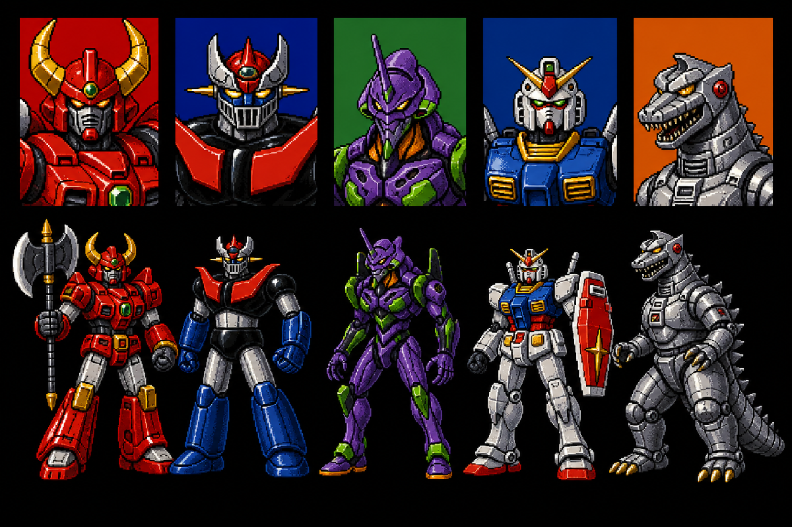

# 五人選角與無敵鐵金剛 HUD vertical slice

這批資產完成 M1 coverage 最後四個缺口：一張 480×276 五人選角合成圖，以及張飛 slot／無敵鐵金剛的 35×54 model icon、HUD profile、mirror profile。



## 選角 roster 與欄位順序

| Column | OpenBOR slot | 本專案方向 | 選角圖內容 |
| ---: | --- | --- | --- |
| 1 | `guanyu` | 紅色合體機／蓋特型角色語彙 | 上方頭肩肖像、下方持雙刃斧全身站姿 |
| 2 | `zhangfei` | 無敵鐵金剛 | 上方頭肩肖像、下方黑紅胸甲／藍色前臂全身站姿 |
| 3 | `zhaoyun` | 紫綠生體機甲／EVA 型角色語彙 | 上方肖像、下方高瘦全身站姿 |
| 4 | `huangzhong` | 白藍紅軍用人形機／RX-78 型角色語彙 | 上方肖像、下方盾牌全身站姿 |
| 5 | `weiyan` | 銀色機械恐龍 | 上方頭部肖像、下方全身與尾部站姿 |

這些名稱是私有 fan-project 的角色方向與團隊搜尋詞；公開圖是新生成的完整選角審稿總覽，不是從原作 sprite 裁切。公開 repo 不提供可直接抽出的單人頭像或 35×54 production GIF。

## OpenBOR 檔案契約

| Output | Canvas | Source mapping | 用途 |
| --- | ---: | --- | --- |
| `data/bgs/select.gif` | 480×276 | 1536×1024 原創 roster 的中央 1536×883 crop，nearest-neighbor resize | 五人頭像與全身站姿的合成選角底圖 |
| `data/chars/zhangfei/icon.GIF` | 35×54 | 第二欄上方無敵鐵金剛肖像 crop | 張飛模型 icon |
| `data/profiles/zhangfei.GIF` | 35×54 | 同一 master portrait | `lifeBar.c` HUD profile |
| `data/profiles/zhangfei_m.GIF` | 35×54 | master portrait 水平鏡像 | HUD 後備／另一方向 profile |

Builder 另產生 `data/chars/zhangfei/zhangfei.txt` overlay，把模型 icon 引用正規化為實體 physical case `icon.GIF`。其他 37 組張飛大小寫債務目前只在 disposable staging 建 alias；production model cleanup 尚未完成。

## Opaque UI 與 palette index 0

選角圖是黑底的完整 UI raster，不需要使用 index 0 像素來挖透明洞，但本專案仍要求所有 GIF palette slot 0 精確為 `#FC00FF`。

Builder 先限制為最多 255 個實際顏色，再找一個未使用 palette index 注入 `#FC00FF`，最後交換到 slot 0。結果：

- GIF 是 indexed palette。
- palette index 0 精確為 `#FC00FF`。
- opaque pixel data 不使用 index 0，所以黑色背景與彩色肖像不會出現洋紅洞。
- 不加入 GIF transparency extension。

## 建立 overlay

```bash
node scripts/build-five-robot-selection-p0-prototype.mjs \
  --source private_assets/robot_wof/ui/five-robot-selection-screen-v1.png \
  --data-dir workplace/extracted/data \
  --output-dir workplace/robot_wof_vertical_slice/overlay \
  --overview research/ui/five-robot-selection-screen-v1-overview.png
```

來源圖、輸出 mapping 與 SHA-256 見 [`five-robot-selection-p0.json`](../research/manifests/five-robot-selection-p0.json)。

## 驗證結果

| Gate | Result |
| --- | --- |
| Vertical-slice coverage | 89/89；所有 M1 預定 replacement 類別完成 engineering coverage |
| Overlay parity | 107 files：94 GIF＋13 TXT；exact-case counterpart、canvas、indexed GIF、index0 全 PASS |
| Zhangfei model strict | 447 次引用、86 個唯一圖像路徑全部解析（disposable staging case aliases） |
| Stage01 level strict | 4 個唯一背景／FX 路徑 PASS |
| `baoxiang` strict | 3 個唯一圖像路徑 PASS |
| Docker OpenBOR | v7533 到 `Loading models... Done!`；bounded timeout exit 124 |

89/89 表示「M1 預定檔案都已替換且不是 base copy」，不代表完成全遊戲，也不代表美術 production-ready。Docker model-load 也沒有自動操作選角 cursor 或進入 Stage01。

## 可視 gameplay 尚待驗收

- 選角 cursor 在五欄之間移動時，頭像與實際 model slot 不錯位。
- 1P／2P join、倒數、確認／取消與 palette variant 不蓋住頭像。
- 五個全身站姿腳底一致，斧、盾、長角與尾巴沒有被 480×276 邊界裁掉。
- 35×54 icon 在 HUD 實際縮放後仍看得出無敵鐵金剛，不糊成紅黑色塊。
- `zhangfei.GIF`／`zhangfei_m.GIF` 的方向、HUD 位置及雙人模式後備路徑正確。
- 沒有在選角後或血條刷新時閃回張飛原頭像。

## Production 缺口

- 五欄圖仍是生成式 engineering redraw；需由 UI／pixel artist 清理角、斧、盾、手指、腳底與欄寬。
- M1 只要求張飛 HUD 三張；其餘四名角色各自的 model icon＋兩張 profile 仍屬 M2，不能把選角合成圖當成十幾張 UI 小圖已完成。
- 現有選角圖沒有文字；角色名稱與提示若由其他 UI 圖或字型顯示，需另做跨語系與 2P layout review。
- 公開總覽只能作美術協作參考；發行時要重新確認所有角色造型與名稱的權利範圍。
