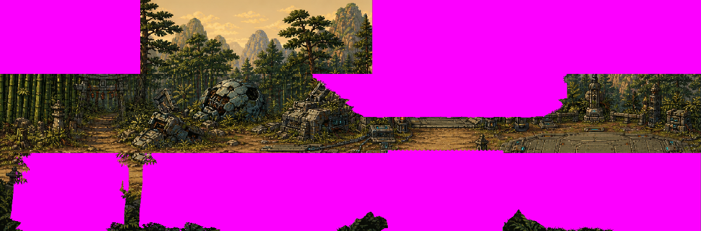
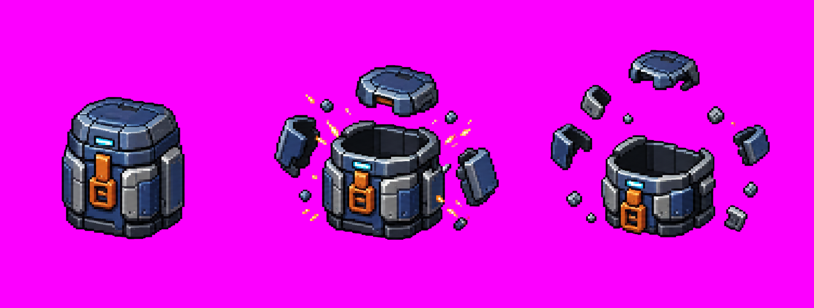
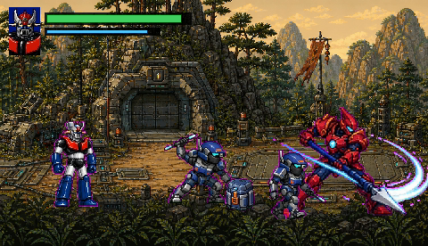

# Stage01 場景與機械補給箱 vertical slice

這批資產把第一關開場從原森林底圖改成「古代山林 × 原創機械前哨基地」的 engineering prototype，並加入第一個機械補給箱。公開 repo 只保存原創審稿總覽、幾何 manifest 與重建腳本；實際 OpenBOR GIF、來源 PNG 與 extracted data 留在私有 overlay。







這張 480×276 圖由目前 private overlay 的實際輸出合成，可在 GitHub 直接展示完成成果；它不是 runtime capture。產生器是 [`build-stage01-engineering-preview.mjs`](../scripts/build-stage01-engineering-preview.mjs)。

## 目前驗證狀態

| 項目 | 結果 |
| --- | --- |
| Stage01 圖層 | `S2.gif` 2600×276、`panel.gif` 2429×276、`f.GIF` 2429×272、`sunshine1.gif` 480×272 |
| 補給箱 | `baoxiang.gif` 66×45、`1.GIF`／`2.GIF` 141×114；3/3 physical GIF |
| exact-case | 9 個引用 Stage01 背景的 level TXT 已把 `f.gif` 正規化成實體 `f.GIF`；`baoxiang.txt` 兩個 fall frame 引用也已正規化 |
| overlay parity | 加入李典 Boss 後，目前整包 182 files：163 GIF＋19 TXT 全部有 exact-case base counterpart；canvas、indexed GIF、index 0 通過 |
| level strict | `NewWof/1/01.txt` 的 4 個唯一圖像路徑全部解析；palette index 0 全為 `#FC00FF` |
| box strict | `baoxiang.txt` 的 3 個唯一圖像路徑全部解析 |
| coverage | M1 89/89；背景 3/3、補給箱 3/3、選角與張飛 UI 缺口均已完成 engineering replacement |
| Docker smoke | OpenBOR v7533 到 `Loading models... Done!`；20 秒 bounded timeout exit 124 符合預期 |
| production 狀態 | `productionReady: false`；尚未完成逐 viewport 可視 gameplay review、像素美術清稿與金屬破壞音效 |

Docker 在模型載入完成後收到 TERM，仍可能出現 v7533 已知的 teardown `double free or corruption`；只有停止前 Log 已完成 model load 且沒有資產錯誤時，才把 load gate 判為通過。

## 背景來源與公開邊界

背景來源是新生成的原創 2172×724 點陣全景，不含概念頁像素、既有角色或可辨識的版權機體。美術 brief 只取本機 concept 的高階方向：

- 深綠垂直樹幹、較亮的中央 dirt clearing、底部前景葉叢。
- 古代森林道路混入原創裝甲殘骸、維修板、電纜、半埋式格納庫與指揮官 arena。
- 暖色夕照搭配低亮度青色機械燈，避免背景搶過角色。

私有來源：

```text
private_assets/robot_wof/stage01/environment/
  stage01-forest-outpost-panorama-v1.png
```

公開 GitHub 不保存三張 production layer GIF，只保存一張縮小總覽。概念 JPEG 仍由 `.gitignore` 排除。

## 為何使用原透明遮罩

這一輪只換視覺，不改關卡幾何。Builder 讀取原 `S2.gif`、`panel.gif`、`f.GIF` 時只使用「palette index 0／非 index 0」二值遮罩，不複製底圖顏色：

1. 從原創全景切出遠景、行走面、前景三條橫向來源帶。
2. resize 到各自原 canvas。
3. 以 base index-0 footprint 切出透明區，保留天空開口、橋洞與前景遮擋位置。
4. 每層重新量化為 indexed GIF，強制 palette index 0=`#FC00FF`，不加入 GIF transparency extension。

下一輪若要把 Stage01 從 engineering coverage 推進到可交接的 production 清單，請直接看 [`../research/manifests/stage01-next-queue.json`](../research/manifests/stage01-next-queue.json)；那份檔案把長圖、雜兵、Boss、UI 與跨平台 smoke 的剩餘工作列成 pending queue。

這樣可保留 wall／hole、地平線與前景層級的基本契約，又不把原底圖像素帶進新資產。

背景 geometry、base SHA-256、六個 480×276 viewport 與四個 wall polygon 都在 [`STAGE01_BACKGROUND_VIEWPORTS.json`](../research/STAGE01_BACKGROUND_VIEWPORTS.json)。

## 重要的 fglayer 修正

`01.txt` 這兩行：

```text
fglayer data/bgs/01/f.GIF -220 0 0 0 0 0 0 1 1 1
fglayer data/bgs/01/f.GIF -20  0 0 0 0 0 0 1 1 1 6
```

`-220`、`-20` 是繪製順序／Z 值，不是 X offset。兩層都從 x=0 疊放同一張 `f.GIF`；第二層使用不同 alpha。不能把前景圖誤移到 x=-220／-20。

## 建立背景 overlay

```bash
node scripts/build-stage01-background-p0-prototype.mjs \
  --source private_assets/robot_wof/stage01/environment/stage01-forest-outpost-panorama-v1.png \
  --base-dir workplace/extracted/data/bgs/01 \
  --data-dir workplace/extracted/data \
  --output-dir workplace/robot_wof_vertical_slice/overlay \
  --overview research/environment/stage01-background-p0-overview.png
```

輸出包含：

- 三張長背景與一張 480×272 原創青色戰術掃描光 FX。
- 所有引用 `data/bgs/01/f.gif` 的 level TXT exact-case overlay。
- `STAGE01-BACKGROUND-P0-MANIFEST.json`，狀態固定為 engineering prototype。

掃描光是 deterministic diagonal pattern，不依賴第三方圖像。它也解決原 `sunshine1.gif` palette index 0 為 `#020201`，使 Stage01 level 無法通過嚴格 `#FC00FF` 驗證的問題。

## 機械補給箱

`baoxiang` 是 `type obstacle`、health 5。它沒有子模型、投射物或 gore；破壞碎片直接畫在兩張 `fall` frame。掉落物由 level 的 `Item` 欄位決定，因此箱子圖不能把書、劍或金塊畫死在內部。

| Pose | OpenBOR output | Canvas | Offset | 目標 occupancy |
| --- | --- | ---: | ---: | ---: |
| sealed capsule | `baoxiang.gif` | 66×45 | 38,41 | x1..64、y4..40 |
| rupture A | `1.GIF` | 141×114 | 65,86 | x27..100、y21..85 |
| rupture B | `2.GIF` | 141×114 | 65,86 | x20..128、y5..92 |

切圖與背景正規化：

```bash
node scripts/slice-baoxiang-storyboard.mjs
```

建立 exact-canvas overlay：

```bash
node scripts/build-baoxiang-p0-prototype.mjs \
  --source-dir private_assets/robot_wof/stage01/supply/keyposes \
  --base-dir workplace/extracted/data/chars/misc/box/1 \
  --output-dir workplace/robot_wof_vertical_slice/overlay
```

Builder 會額外建立 `baoxiang.txt` overlay，把 `1.gif`／`2.gif` 修成實體 physical case `1.GIF`／`2.GIF`。模型的 platform、BBox、health、Offset 與掉落邏輯都不變。

## 驗證流程

```bash
node scripts/validate-overlay-parity.mjs \
  --base workplace/extracted/data \
  --overlay workplace/robot_wof_vertical_slice/overlay/data

node scripts/validate-vertical-slice-coverage.mjs \
  --base workplace/extracted/data \
  --overlay workplace/robot_wof_vertical_slice/overlay/data

STAGE=/tmp/robot-wof-stage01-check
node scripts/prepare-openbor-smoke.mjs \
  --base workplace/extracted/data \
  --overlay workplace/robot_wof_vertical_slice/overlay/data \
  --output "$STAGE"

node scripts/validate-openbor-assets.mjs \
  --data "$STAGE/data/levels/NewWof/1/01.txt" --strict

node scripts/validate-openbor-assets.mjs \
  --data "$STAGE/data/chars/misc/box/1/baoxiang.txt" --strict

scripts/run-openbor-smoke-docker.sh \
  --binary /path/to/OpenBOR \
  --stage "$STAGE" \
  --seconds 20
```

OpenBOR engine smoke 必須在 Docker 內執行。切圖／量化只使用 repository 腳本與既有 `ffmpeg`；不在 host 安裝套件。

## 可視 gameplay 尚待驗收

靜態 parity 與 model-load 不能證明背景真的好玩。下一個可顯示畫面的 runner 必須逐一截圖：

- `V00`、`V01`、`V02`、`V03`、`V04`、`V05` 以及 S2 tail。
- W1／W2／W3／W4 附近，確認岩壁、橋洞與實際碰撞一致。
- `f.GIF` 兩次疊加後不長時間遮住角色、敵人或攻擊回饋。
- 補給箱 idle→rupture A→rupture B 的腳底與碎片位置，並確認不同 Item 掉落不被箱圖遮住。
- 青色掃描光不頻閃、不壓過 HUD，也沒有整片洋紅框。

## Production 缺口

- 背景由一張全景的三條橫向來源帶建立；需由 environment artist 做逐 viewport 接縫、透視與重複紋理清稿。
- 目前 mask 保留原 footprint，但新場景物件和 wall 的視覺語意仍需人工逐點對照。
- 補給箱縮至 66×45 後需像素藝術家人工整理 cyan 燈、橙色扣件與爆裂碎片。
- `diesound data/sounds/box.wav` 仍是木箱聲；正式版要改成原創私有 metal-break 音效，不能全域覆寫其他箱子共用聲音。
- 書、劍、金塊等掉落物仍是後續道具替換工作。
