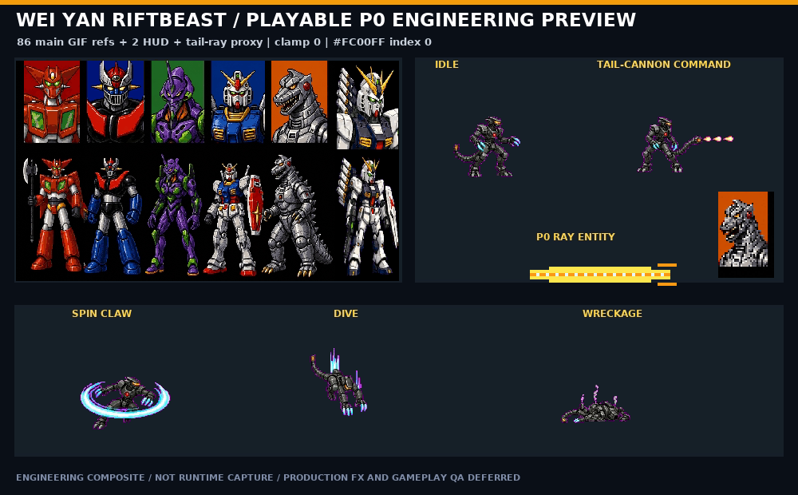
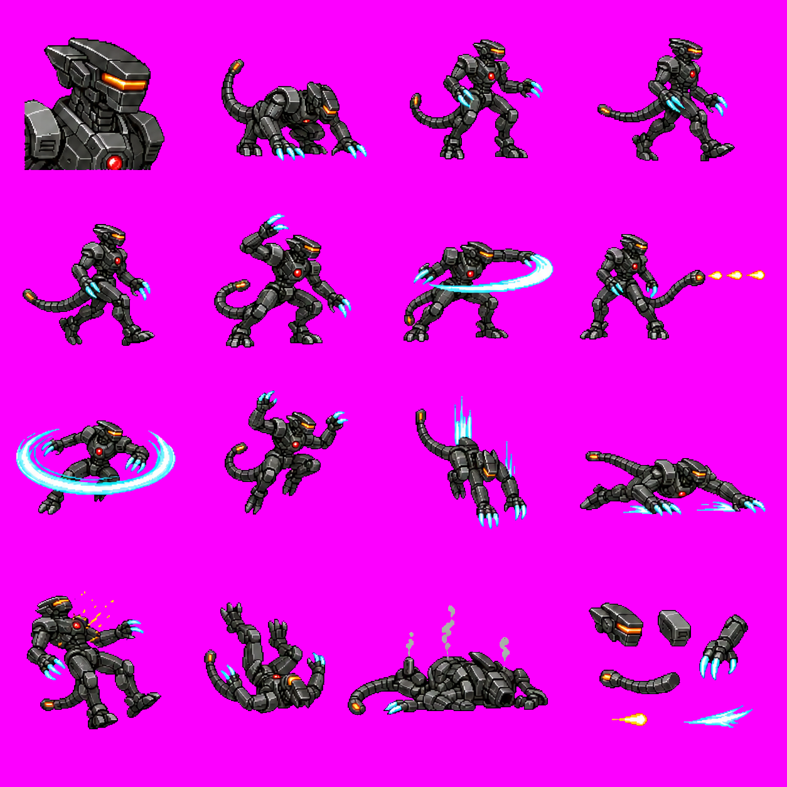
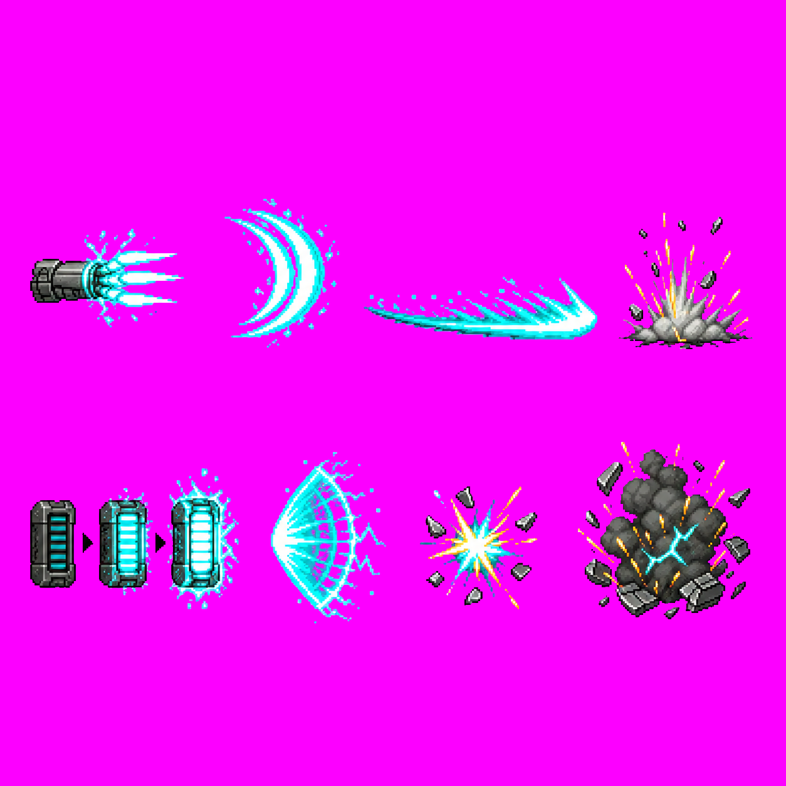

# 魏延裂界獸 P0 vertical slice

這批把魏延 slot 收斂成裂界獸／機械哥吉拉方向的第五星候選角色。成果是 private engineering runtime：84 張 action GIF、`icon.gif`、identity-palette `red.gif`、2 張 lowercase HUD profile，以及 3 張 GIF 的 `weiyan_tail_ray` P0 尾砲代理。它已通過兩次 fresh build、strict dependency／幾何 validator 與 Docker OpenBOR v7533 model-load；尚未通過可見畫面的選角、進關、1P／2P 與 production 動畫驗收。



上圖由 private runtime GIF 可重現合成，是 engineering composite，不是 runtime capture。





公開 repo 只保留完整 overview、crop／pivot manifest、文件與重建／驗證腳本。可拆用的 PNG key pose、個別 GIF、模型 TXT 與 canonical source 存放在 private 素材 repo。

## 已完成的工程閉包

| 類別 | 實測結果 |
| --- | --- |
| 主角色 | 84 action GIF＋`icon.gif`＋`red.gif`＝86 個主模型 GIF refs；489 次 image occurrence |
| HUD | `weiyan.gif`、`weiyan_m.gif`，35×54 opaque indexed GIF；採 lowercase 配合 HUD script |
| 尾砲 P0 | `weiyan_tail_ray` 獨立支援模型、3 張 indexed GIF，傷害目標只有 `obstacle enemy` |
| 人類武器 | 主模型的 `weapons w1..w16`、`hmap`、3 個 `weaponframe` 均移除；spawn 只保留 `setLevel()` |
| 人類效果 | 3 個 blood hitflash、16 個 knife hit FX、15 個角色語音引用改成既有機械 placeholder |
| Runtime batch | 95 個非 manifest 檔案、91 張 GIF；兩次 fresh build 逐檔 byte-identical |
| 合併 overlay | `data/` 679 files：639 GIF＋40 other |

`models.txt` 先 `Load weiyan_tail_ray` 再 `Load weiyan`。舊的 `know w1..w16` 可以暫留在全域 cache 供其他流程使用，但新魏延的主模型與 spawn 已無可達引用；`blackw` 是選角等待黑幕 helper，必須保留。

## 幾何與透明色契約

- body canonical 使用 v2。v1 的死亡殘骸缺尾巴，只保留作歷史比較，不得回退。
- 原概念圖是漸層洋紅，不可只把單一 RGB 當透明。slicer 先依 HSV hue 285–335°、saturation/value 皆至少 0.35 清理，再統一成精確 `#FC00FF`。
- 所有 transparent runtime GIF 都是 indexed GIF，palette **index 0** 精確為 `#FC00FF`（RGB 252,0,255）。不要用 `#FF00FF`、alpha 或 GIF transparency flag 代替。
- builder 逐張量測原 Wei Yan GIF 的前景 bbox 中心與腳底，把新 pose 縮到一像素 safe inset；不可把 model `Offset` 當 raster anchor，也不可 hard clamp。
- 84 張 placement 實測新增 canvas edge=0、最大中心／腳底漂移 1px、最小 safe scale ratio 約 0.7462。
- 原資料已有 `slide1.GIF`、`f3.GIF`、`grabja6.GIF`、`get.GIF` 貼邊；驗收規則是「不可新增貼邊」，不是假稱原始輸入全部不貼邊。

body F08 尾砲、F09 光圈、F11 速度線、F12 拖曳光、F13 火花與 F15 煙霧目前仍 baked in。第 16 格是零件／彈體 inventory，不能當成完整 body pose。local-FX F05 同時含三個充能狀態，production 應再拆成三張獨立圖。

## Docker 隔離重建

素材切圖、GIF 量化與成果圖都使用固定 Node 22＋FFmpeg image，不在 host 安裝依賴：

```bash
docker build -f docker/asset-tools.Dockerfile \
  -t openbor-asset-tools:local .
```

先把兩張 private canonical storyboard 切成 private key pose，並輸出公開 overview／manifest：

```bash
docker run --rm --user "$(id -u):$(id -g)" \
  -v "$PUBLIC_REPO:/repo" \
  -v "$PRIVATE_WORKSPACE:/workspace" \
  -w /repo openbor-asset-tools:local \
  scripts/slice-weiyan-riftbeast-storyboards.mjs \
  --body-source /workspace/private_assets/robot_wof/weiyan/weiyan-riftbeast-storyboard-v2.png \
  --fx-source /workspace/private_assets/robot_wof/weiyan/weiyan-riftbeast-local-fx-storyboard-v1.png \
  --body-output-dir /workspace/private_assets/robot_wof/weiyan/keyposes-v2 \
  --fx-output-dir /workspace/private_assets/robot_wof/weiyan/fx-keyposes-v1
```

再把已驗證的六欄 `select.gif` 與 active template 以唯讀方式掛入，一次性建立 runtime：

```bash
docker run --rm --user "$(id -u):$(id -g)" \
  -v "$PUBLIC_REPO:/repo:ro" \
  -v "$PRIVATE_WORKSPACE:/workspace:ro" \
  -v "$OUT:/out" \
  -w /repo openbor-asset-tools:local \
  scripts/build-weiyan-riftbeast-p0-prototype.mjs \
  --source-dir /workspace/private_assets/robot_wof/weiyan/keyposes-v2 \
  --keypose-manifest /repo/research/manifests/weiyan-riftbeast-v2-keyposes.json \
  --base-data /workspace/workplace/extracted/data \
  --template-data /workspace/workplace/robot_wof_vertical_slice/overlay/data \
  --selection-gif /workspace/workplace/robot_wof_vertical_slice/overlay/data/bgs/select.gif \
  --output-dir /out/weiyan-runtime
```

不要讓 builder 直接寫入 `workplace/extracted/` 或 active overlay。先對兩份 fresh output 做非 manifest 逐檔比較，再執行 strict validator：

```bash
node scripts/validate-weiyan-riftbeast-runtime.mjs \
  --base-data "$PRIVATE_WORKSPACE/workplace/extracted/data" \
  --template-data "$PRIVATE_WORKSPACE/workplace/robot_wof_vertical_slice/overlay/data" \
  --build-dir "$OUT/weiyan-runtime"
```

最後才把通過的 batch 合併到 disposable stage，依 [Docker 隔離編譯與 smoke test](DOCKER_LINUX_BUILD.md)用 GIF-compatible OpenBOR v7533 驗證。不要以新版本引擎拒絕舊模組 GIF background 的錯誤誤判角色素材。

## 實際驗證結果

| Gate | Result |
| --- | --- |
| Determinism | 兩次 fresh build；95/95 non-manifest files byte-identical，manifest 只差 `generatedAt` |
| Wei Yan validator | 84 action GIF、86 main refs、103 exact-case data refs、missing=0 |
| Placement | hard clamp=0、added edge=0、最大 anchor drift=1px |
| 人類武器 closure | 16 variants disabled；主模型無 `weapons`／`hmap`／`weaponframe`；spawn 無 `loadmodel("w...")` |
| 尾砲 closure | 3 resolved GIF；`type none`＋hostile projectile contract；`candamage obstacle enemy` |
| Docker OpenBOR | v7533 cache `weiyan_tail_ray`、`weiyan`，到 `Loading models... Done!` |
| Bounded smoke | exit 124 是 timeout 預期值；載入完成後舊引擎 teardown double-free 不當作 gameplay PASS |

OpenBOR v7533 不接受這個 P0 支援模型使用 `type shot`；實測後已改成與既有可載入 projectile 相同的 `type none`＋hostile/candamage 結構。機器可讀證據見 [`weiyan-riftbeast-p0-runtime-audit.json`](../research/manifests/weiyan-riftbeast-p0-runtime-audit.json)。

## 明確 deferred

- 可見 runner 的六人選角、選魏延、Ready、Stage 1 進關與 runtime screenshot。
- 1P／2P 實戰、BBox／attack box／grab box、尾砲 spawn origin、深度排序與碰撞 QA。
- 尾砲的 charge／beam／impact／cleanup、獨立旋轉光圈、速度線、拖曳光、火花、煙霧與原創音效。
- 16 個 body key pose 的 production in-between、walk cadence、攻擊 anticipation/contact/recovery、受擊、起身與死亡。
- `blackw` 以外 dormant 魏延支援模型的最終清理，以及全域 shared gore/audio 的模組級替換。

因此正確狀態是「魏延裂界獸 P0 engineering runtime 已通過 deterministic、strict 與 v7533 model-load」，不是 production-ready，也不代表整款機器人大戰版已完成。
