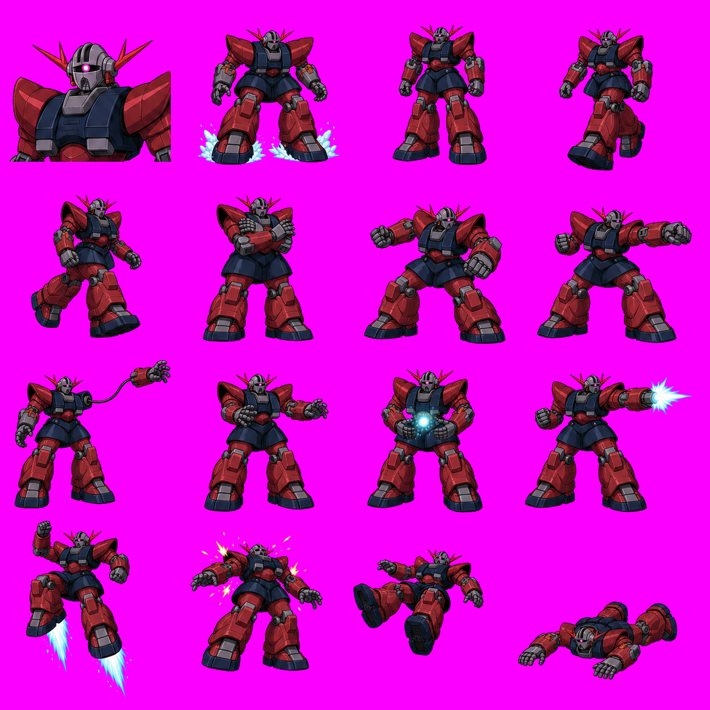

# 夏亞／有腳吉翁克 Boss 工程計畫

`zeon_boss` 是由夏亞駕駛的完成型、有腳大型 Boss，不占第六個玩家角色。精確機體與人物圖屬 private fan-project、`rights-unverified`；public repo 只保存工程規格、驗證方法與素材政策，不放可拆用的個別 production GIF 或夏亞大頭像。

若要直接檢查這份候選分鏡是否仍與 manifest 一致，先看 [`../research/ZEON_BOSS_RUNTIME_AUDIT.md`](../research/ZEON_BOSS_RUNTIME_AUDIT.md)。

此 v2 總覽已確認 F6／F7 的完整雙腳、F9 有線分離手臂、F10 回收與 F15／F16 完整肢體；它仍是 `art-candidate/custom-crop-only`。F8、F12–F16 有少量越過名義 4×4 格線，production slicer 必須使用逐格 bbox，不能直接四等分。公開 PNG 已用 edge-connected matte 將背景正規化為精確 `#FC00FF`，但不等於 67 張 runtime GIF 已完成。

## 模型骨架

首選模板是 `data/chars/boss/xiahoudun/xiahoud.txt`，因為它同時具備大型 Boss HP、近戰、衝刺、跳攻、抓投、遠距招式及低血量彈幕。不要直接沿用 `xiahorse`：馬匹、武器切換與複合 spawn 會增加不必要的狀態閉包；`lidian` 也已被紅槍指揮官使用。

| 契約 | P0 值 |
| --- | --- |
| Runtime model id | `zeon_boss` |
| 主體 canvas | 178×154 |
| 典型 offset／pivot | 約 75,132；仍須逐 GIF 依原動畫驗證 |
| 機體可見高度 | 112–120 px，約玩家 1.35–1.5 倍 |
| 待機寬度 | 建議不超過 145 px |
| Pilot | 夏亞；人物 UI 與機體 sprite 分離 |

若直接放大到 220×180，就必須全面重算 offset、bbox、attack box、grab position 及關卡碰撞；因此首輪保持原 canvas，先建立可載入與可戰鬥的工程閉包。

## 最小 private runtime 閉包

| 類別 | GIF 數 | 說明 |
| --- | ---: | --- |
| Boss 主體 | 48 | 對應原模板 runtime body GIF |
| Boss HUD | 1 | 480×272；機體頭像／Boss 血條，不是夏亞人物 profile |
| Projectile | 9 | 自有 `zeon_beam`／`zeon_psycommu_bolt`，不可共用舊 `lei3` identity |
| Robot debris | 8 | 頭、手臂、裝甲等三個 submodel；取代人類碎件 |
| Pilot cut-in | 1 | 夏亞 64×94，`data/story/pro/char_pilot.gif` |
| 合計 | **67** | 不含 TXT、stage edit 與 shared palette-only FX |

TXT 最低包含 Boss、projectile、三個 debris、dialogue 六份，另需 `models.txt` 註冊及三組 NewWof `02.txt` 關卡 spawn 修改。

## 16 格主體與 FX 分離

主體 4×4 應涵蓋：機體頭像、重落地、idle、walk contact、walk passing、guard、近戰蓄勢、重擊、單臂有線發射、手臂回收、粒子砲充能、發射後座、推進跳攻、受傷、擊飛、完整倒地。除明確有線手臂攻擊外，每個 full-body pose 都必須有兩手、兩腿、兩腳；「有腳」不得只出現在 idle。

另做 4×2 FX／debris 表：飛行彈、充能、三段命中、機械頭、手臂與裝甲碎片。長光束及離體手臂應是獨立 entity，不畫死在主體 animation canvas。

## 移除舊人類語彙

- 移除 `xhorse/weapons` 與馬匹子狀態。
- 把 `lei3` 換成自有 projectile model。
- 把 `xiahoudunxs`／`xs1`／`xo` 換成機械 head／arm／armor debris。
- 清除 `blood`、`blood1`–`blood3`、`hand`、`meat`、`fei`、`gan`、`chang`、`pi`、`rou` 等人類血肉 spawn。
- 新 model 全部使用小寫正斜線路徑；不要照抄模板既有 24 組、156 次 Linux case debt 與反斜線。
- 原攻擊 script 的 HP 條件有 50、51、100 空洞；新版本應使用 `hp <= 50`、`else if hp <= 100` 並測三個邊界。

## 夏亞 cut-in 與故事分層

| 層 | 建議 ID／路徑 |
| --- | --- |
| 機體模型 | `zeon_boss` |
| Boss HUD | `data/chars/boss/zeon_boss/boss_hud.gif` |
| Story | `data/story/diag/zeon_boss.txt` |
| Pilot key | `char_pilot` |
| Pilot portrait | `data/story/pro/char_pilot.gif`，64×94 |

以 `spawnStory "zeon_boss"` 開啟新對話，避免回讀夏侯惇故事與 64×94 人類舊圖。繁中顯示名「夏亞」應走已驗證的 localization／encoding 流程；不要未測試便把 UTF-8 中文硬寫進 legacy model 或 dialogue 檔。

## 第一整合點與驗證

先在 `data/levels/NewWof/1/02.txt` 的夏侯惇 Boss 點把 `spawn xiahorse` 換成 `spawn zeon_boss`；通過後再同步 `NewWof/{2,3}/02.txt`。

驗證必須包含：67 張 GIF 的 canvas／indexed palette／index0 `#FC00FF`、TXT exact-case strict、Docker model-load、登場對話、夏亞 cut-in、Boss HUD、Blockade、近戰、抓投、遠距、HP 50／51／100 招式分支、投射物清場、機械死亡碎件，以及全流程不閃回馬匹或人類血肉素材。
