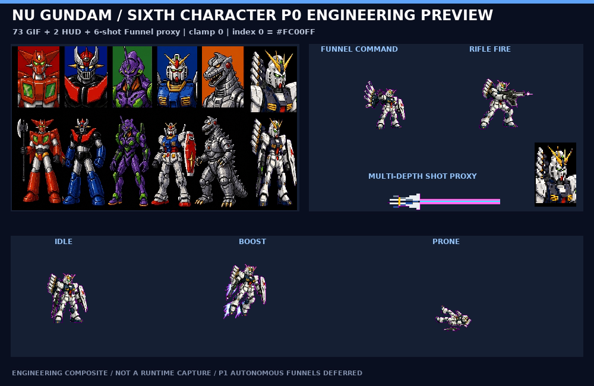
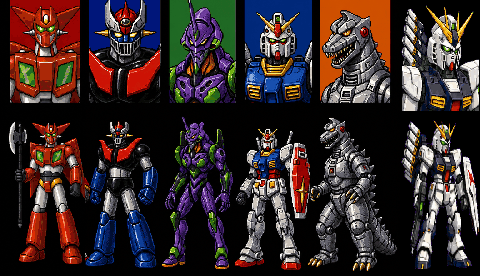

# Preview gallery

This page is generated from the current repository image set. It is an overview of the public/review assets already present in the tree, not a claim of game completion.

Total images: 29

## research/boss

- lidian-red-spear-commander-storyboard-v1-keyed.png
  - 

## research/contact-sheets

- guanyu.png
  - 
- huangzhong.png
  - 
- portrait-assets.png
  - 
- weiyan.png
  - 
- zhangfei.png
  - 
- zhaoyun.png
  - 

## research/enemy

- blue-helmet-grunt-storyboard-v1-keyed.png
  - 

## research/environment

- stage01-background-p0-overview.png
  - 

## research/guanyu

- guanyu-getter-v2-storyboard-v5-overview.png
  - 
- guanyu-red-crescent-warrior-storyboard-v1-keyed.png
  - 

## research/huangzhong

- huangzhong-azure-photon-ranger-storyboard-v1-keyed.png
  - 
- huangzhong-photon-projectile-fx-storyboard-v1-keyed.png
  - 

## research/mazinger

- mazinger-keyposes-contact-sheet.png
  - 

## research/nu-gundam

- nu-gundam-sixth-character-storyboard-v5-overview.png
  - 

## research/previews

- guanyu-getter-v2-p0-engineering-preview.png
  - 
- huangzhong-p0-engineering-preview.png
  - 
- nu-gundam-sixth-character-p0-engineering-preview.png
  - 
- stage01-engineering-composite.png
  - 
- weiyan-riftbeast-p0-engineering-preview.png
  - 
- zhaoyun-p0-engineering-preview.png
  - 

## research/props

- baoxiang-mechanical-capsule-storyboard-v1-keyed.png
  - 

## research/ui

- five-robot-selection-screen-v1-overview.png
  - 
- five-robot-selection-screen-v2-getter-overview.png
  - 
- six-robot-selection-screen-v1-overview.png
  - 

## research/weiyan

- weiyan-riftbeast-local-fx-storyboard-v1-overview.png
  - 
- weiyan-riftbeast-storyboard-v2-overview.png
  - 

## research/zeon-boss

- zeon-boss-with-legs-storyboard-v2-overview.png
  - 

## research/zhaoyun

- zhaoyun-violet-synapse-lancer-storyboard-v1-keyed.png
  - 
